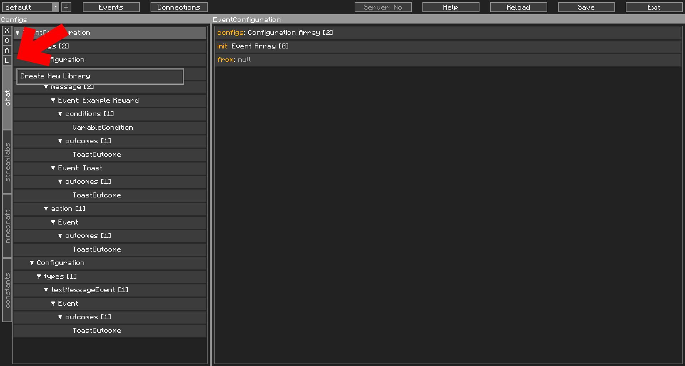

Libraries&#58; Not The Book Kind
================================

Libraries are a direct extension of [Constants](../../intermediate/constants/).

Libraries are essentially `Constants` files with a different purpose. They are meant to be distributed to other people for their use. Similarly to what you see in [Programming](https://en.wikipedia.org/wiki/Library_(computing)).

Libraries are a set of `Constants` JSON files that are loaded from the `/contentcreatorintegration/libs/` folder. They span all the various profiles made in CCI and are all combined together to be called as a Constant. Therefore, to reference an Event, Condition, or Outcome in a Library, you call them the same way you call a Constant. 

Also, as a result, they can potentially conflict, if their names match one another. With this in mind, it would be a good idea to prefix your Constants' names with the name of the library, eg an `AwesomeSauceLib` library should have their names be like: `[AwesomeSauceLib] Increase your viewer count with 10 easy steps`. 

## Creating a Library

CCI tries to assist a little in creating a library, with that little `L` key in the Navigator that lets you preview and edit existing libraries or make new ones. In our example here, we have no libraries loaded, but a giant red arrow to help you find the button:

{: class="img_center"}
 
 

Edit the library, **Test it**, and feel free to add them to our [documentation repository](https://github.com/iChun/ContentCreatorIntegration-IssuesAndDocumentation), with instructions on install and use in the [Libraries section](../../libraries/)
