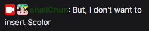
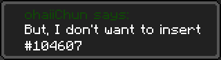

When Variable Insertion Goes Wrong
==================================

| Protip |
| ------ |
| `VariableInsertCondition` has no relation to the variable insertion here. `VariableInsertCondition` inserts a variable into the variables list while "variable insertion" inserts a variable value into a String.       |

Variable Insertion. You name the variable, CCI inserts the value. Rinse and repeat. Put simply, [recursion](https://en.wikipedia.org/wiki/Recursion_(computer_science)). Sometimes, it can go wrong.

Example, a Twitch chat message:

{: class="img_center"}
 
 

And yet, when it pops up in a toast:

{: class="img_center"}
 
 

In this example, the `$message` of `But, I don't want to insert $color` also has a variable in it. But Twitch chat variables also have `$color` to define the user's name colour. As CCI's variable insertion is recursive, it inserts `$message`, tries again, sees the `$color` variable in `$message`, and inserts `$color`, resulting in what you see in the toast.

This is one such example where you might want to limit variable insertion recursion, or even disable it entirely. 

To do this, you insert a new variable with `VariableInsertCondition` called `variableInsertionMaxRecursion` with a number. Setting it to `-1` will disable insertion entirely, and any number above that limits the maximum recursion. Here, we still want `$message` to pop up in the toast, but not `$color`, so we set `variableInsertionMaxRecursion` to `0`. This means CCI will insert the variables only once and stop there.

To reinstate normal function, just remove `variableInsertionMaxRecursion` with a `VariableRemoveCondition`.
