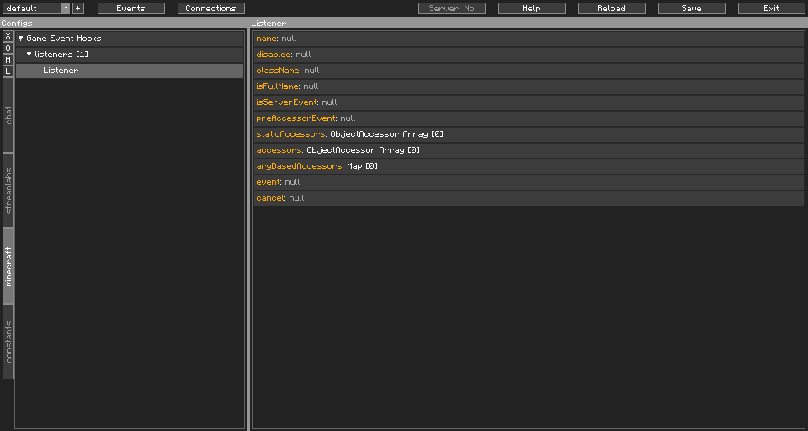
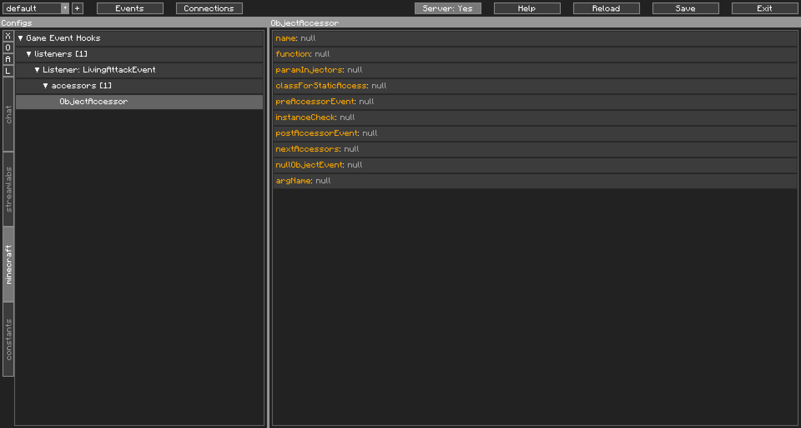
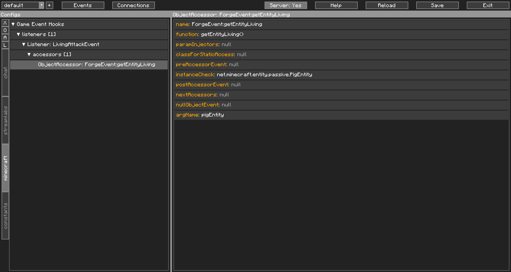
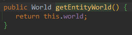
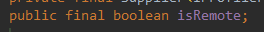
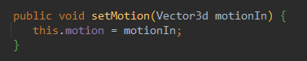
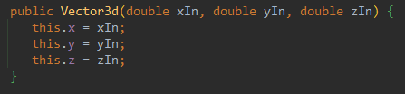
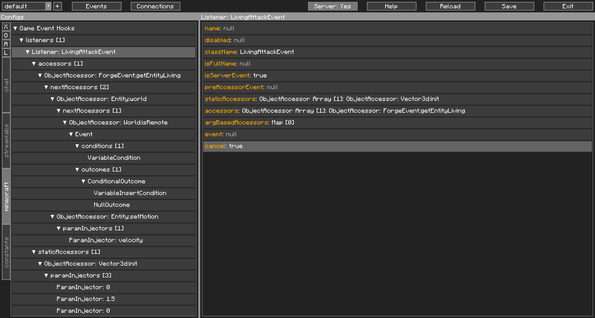

Game Event Hooks&#58; The Config Maker&#39;s Nightmare
======================================================

**Warning**: You will need a [Forge Development Environment](https://mcforge.readthedocs.io/en/1.16.x/gettingstarted/#from-zero-to-modding) for this. This feature is not available on Fabric builds of CCI.

## Game Event Hooks: An Introduction

Game Event Hooks, or which I will refer to more frequently, Game Hooks, is a special layer that CCI adds to hook into things that happen in the game using the [Forge Event system](https://github.com/MinecraftForge/MinecraftForge/tree/1.16.x/src/main/java/net/minecraftforge/event). 

Understanding how to use this will require a decent grasp of Java, Java's [Reflection](https://www.oracle.com/technical-resources/articles/java/javareflection.html), and modding with Forge, on top of normal CCI use.

Game Hooks is primarily driven by Reflection, and has three helper classes to aid it:

| Class Name                | Function                                                                                                          |
| ------------------------- | ----------------------------------------------------------------------------------------------------------------- |
| [Listener](../../components/gamehooks/Listener/)       | Checks Forge's Events if it matches what you're looking for and passes the Event to ObjectAccessors               |
| [ObjectAccessor](../../components/gamehooks/ObjectAccessor/) | Used to access fields or functions in an Object's class, which is then passed into its own set of ObjectAccessors |
| [ParamInjector](../../components/gamehooks/ParamInjector/)  | Used to provide arguments types (and their objects) for method invoking                                           |

These three Classes will be outlined better in on their documentation page. This page's aim is more to describe the practical approach of using them.

<br />

## The Helpers, and How to Use Them

I find that the best way to show how these work, is by walking you through an example. You will need a Forge dev environment, and **CCI 1.9.0 or later**. I personally use [IntelliJ IDEA](https://www.jetbrains.com/idea/) and MCP mappings. It would be advisable to have the Java Console open as you test this.

### The Flow of Code

Before we get started, let me introduce to you the flow of code:

```text
"--->" indicates that the previous event will progress to the next point
"-/->" indicates that the previous event may stop progression
"a:, b:, c:" indicates potential different paths

Forge Event Happens --->
  Listener begins processing --->
    Listener's preAccessorEvent triggers -/->
      Listener's staticAccessors triggers LOOP_1 -/->
         Listener's accessors triggers LOOP_1 -/->
           Listener's argBasedAccessors triggers LOOP_1 -/->
             Listener's event is triggered -->
               Listener cancels Forge Event (if applicable)

LOOP_1:
ObjectAccessor triggers preAccessorEvent -/->
   ObjectAccessor does its accessor thing --->
    a: Instance check, if set -/-> Insert object in arg, if set --->
      ObjectAccessor postAccessorEvent is triggered -/->
        ObjectAccessor's nextAccessors triggers their LOOP_1 ---> 
    b: No Object, nullObjectEvent is triggered -/->

```

### Teaching by Example

So the example I'd like to use, is to make a pig jump by punching it.

Let's have a look at a new Listener in the Editor first:

{: class="img_center"}
<br />
<br />

Listeners will require the Class name (name: `className`). This can be either:   

  * The Class' simple name (including the parent class, if this is an inner class). Eg: `PlayerEvent$ItemPickupEvent`  
  * The Class' full name. Eg: `net.minecraftforge.event.entity.living.LivingAttackEvent`. This is done by setting `isFullName` to true.  

For this, we will need to listen for the `LivingAttackEvent`. Go ahead and create a listener and set the `className`. 

| Protip                                                                                                                                                              |
| ------------------------------------------------------------------------------------------------------------------------------------------------------------------- |
| Some events trigger on the server side. In events of Dedicated Servers, you will need to tell Listener to send you the arguments by setting `isServerEvent` to true |

If you want this to work on dedicated servers, follow the protip above.

Next up we have the `preAccessorEvent`. This is an optional Config Event that you can create just to populate the variables before the rest is triggered. There is one special variable called `stopEventProcessing`. If this variable exists at any point between ObjectAccessors, processing is stopped. Refer back to The Flow of Code to see the breakpoints.

| Important Variance                                                                                                                                                                                     |
| ------------------------------------------------------------------------------------------------------------------------------------------------------------------------------------------------------ |
| Variables here are a bit different. Usually, the variables list contains an assortment of `int`, `double`, `boolean`, `String`, `Object[]` types. Here, our variables will contain `Object`s themselves. |

After that, we have the Object Accessor fields: `staticAccessors`, `accessors` and `argBasedAccessors`. The purpose of an Object Accessor is to take a reference object, and return one of its fields, invoke its methods, or create new Objects with the reference object's class. 

| Field               | Purpose                                                                                                                                                        |
| ------------------- | -------------------------------------------------------------------------------------------------------------------------------------------------------------- |
| `staticAccessors`   | Retrieve static fields or invoke static methods or constructors to add to the variables list before actually referencing the actual Forge Event.               |
| `accessors`         | Retrieve fields or invoke methods on a reference object, or to create new objects using the reference object's class. The first layer receives the Forge Event |
| `argBasedAccessors` | Final set of calls to fields or methods on objects stored in our Variables list                                                                                |

This is what an Object Accessor looks like when created:

{: class="img_center"}
<br />
<br />

We're going to skip `staticAccessors` for now and look at `accessors`. We will need one here, so create one and name it `ForgeEvent:getEntityLiving` (name: `name`) for readability sake.

Now go to your [IDE](https://en.wikipedia.org/wiki/Integrated_development_environment) and look at `LivingAttackEvent`. This ObjectAccessor will get that event as reference, so we ought to take a look at the Class. We want to get the entity that was hurt, through the function `getEntityLiving()`. Let's put that in our Object Accessor in `function`.

We know we want a Pig here, so for `instanceCheck`, we put in the full class name for the pig, `net.minecraft.entity.passive.PigEntity`. We also want to keep the Pig object reference, so let's keep it in a variable called `pigEntity`, in the `argName` field.

At this point, your Object Accessor should look something like this:

{: class="img_center"}
<br />
<br />

| Important |
| --------- |
| Minecraft code is obfuscated, and Forge deobfuscates things. In runtime, all the fields and functions are mapped to something called Searge names (srgName), meaning the field names start with `field_`, and the method names start with `func_`, but in our IDE we see the deobfuscated name, like `world` or `getName`, which are MCP names.<br /><br />For the fields in ObjectAccessor, use Searge names. I will put the ones used in this guide as reference here, but if you want to convert the mapping names, consider checking out the `forge-bot` user in the Minecraft Forge discord (URL in their [Twitter bio](https://twitter.com/forgedevteam)).          |

Now we want to check that we are only triggering on the server-side entity. Add another ObjectAccessor in `nextAccessors`. This ObjectAccessor will get the Pig object as reference.

The most direct way of checking for a server-side entity is by checking the `isRemote` (srgName: `field_72995_K`) field on the World object. So what we have to do next is get a reference to the World object from the Pig.

In this new ObjectAccessor, which I'll be naming `Entity:world`, we have two options:  

| Type   | MCP Name           | Searge Name        |
| ------ | ------------------ | ------------------ |
| Field  | `world`            | `field_145850_b`   |
| Method | `getEntityWorld()` | `func_130014_f_()` |

We can access the field directly, or we can invoke the method to get the World object, because, well, look:

{: class="img_center"}
<br />
<br />

For this, I'll be accessing the field. Go ahead and grab the Searge Name of either, here, it doesn't matter. We don't need to keep this object in our variables list, so let's move on.

Make another ObjectAccessor, now we need the World's `isRemote` field. As usual, name it for readability, I'm calling this one `World:isRemote`.

Let's grab the field, (reminder, the Searge name is: `field_72995_K`), but now we want to keep it in our Variables list, so set `argName` to `isRemote`.

Now, to check which side the Pig is on. Make a new Config Event in `postAccessorEvent`, and in it, a new `VariableCondition`. 

In the `VariableCondition` (id: `variableCheck`), we need to check the Variables list for `isRemote`, so set this to `variableName`.

Now take a look at the `isRemote` field in the World object:

{: class="img_center"}
<br />
<br />

Notice how it is of a `boolean` type. This means it's only either `true` or `false`. What we wanna do now, is to check that it is `true`, so put that in `variableResult`.

"*But, true? I thought we were going to check if we were on a Server.*"

Yes, but we want the Accessors to keep processing, so what we do here, is to stop it if it is on the Client. Make a new `ConditionalOutcome`, and make the condition `VariableInsertCondition` and the outcome `NullOutcome`. 

| Reminder                                                               |
| ---------------------------------------------------------------------- |
| All Config Events require at least one Outcome to be considered valid. |

In the VariableInsertCondition, set `variableName` to `stopEventProcessing`, and whatever you like to `variableInput` to make the condition valid. This tells CCI to stop processing this hook since this Forge Event is triggering for the Pig entity on the Client.

We've done our checks, so now, let's make the pig jump. Go back to `ForgeEvent:getEntityLiving` and add a new ObjectAccessor in `nextAccessors`. This is where we make the pig "jump". I'll be naming this ObjectAccessor `Entity:setMotion`. Set the `function` to `Entity`'s `setMotion()` (srgName: `func_213317_d()`). Here's where things get a little special, take a look at the method in your IDE:

{: class="img_center"}
<br />
<br />

What's special about it? It takes a `Vector3d` argument. The brackets we use just tell CCI that we're calling a method instead of a field.

"*Why not just use the setMotion function below it? It takes 3 doubles.*"

Well, this is my tutorial, and I need to teach you how to use constructors, so just roll with me.

Go back to `staticAccessors` in Listener from earlier. We need it now. Make a new ObjectAccessor, I'm going to call it `Vector3d:init`. To tell CCI that you would like to call a Constructor, just use `<>` in the `function` field. But CCI doesn't have a reference object, so we need to insert the class name in `classForStaticAccess`, which'll be `net.minecraft.util.math.vector.Vector3d`. Go have a look in your IDE:

{: class="img_center"}
<br />
<br />

But wait! The Constructor takes 3 doubles. That's where `ParamInjector`s come in. Make 3 of them in `paramInjectors`. In all three, set `isPrimitive` to `true`, and `classType` to `double`. For the first and third, set `argToPull` to `0`, and for the second, set it to `1.5`. 

This tells CCI that you want a new Vector3d Object using the values you've just set in the ParamInjectors. Essentially `new Vector3d(0D, 1.5D, 0D);`

Back in the ObjectAccessor, we want to keep this Object, so set `argName` to `velocity`.

Go back to `Entity:setMotion`, and create a new ParamInjector there. Now, we insert the Object we just created into the method we're going to invoke. Set the `classType` to `net.minecraft.util.math.vector.Vector3d`, and `argToPull` to the name we just set, `velocity`.

Now, we don't want to actually hurt our Pig friend, do we? We can cancel this Forge Event, so let's do it.

Go back to your Listener and set `cancel` to `true`.

And that's all to it. Save, and test. If done right, the next time you punch a pig, it should shoot up into the sky. If you want to do any additional CCI stuff, make a Config Event in `event`.

For your reference, your Editor should look something like this once you're done:

{: class="img_center"}
<br />
<br />

Here's the [JSON file generated](./files/gamehooks/gamehooks.json) if you're interested in comparing, or if something went wrong and you're not sure where:
```JSON
{
  "listeners": [
    {
      "className": "LivingAttackEvent",
      "isServerEvent": true,
      "staticAccessors": [
        {
          "name": "Vector3d:init",
          "function": "<>",
          "paramInjectors": [
            {
              "isPrimitive": true,
              "classType": "double",
              "argToPull": "0"
            },
            {
              "isPrimitive": true,
              "classType": "double",
              "argToPull": "1.5"
            },
            {
              "isPrimitive": true,
              "classType": "double",
              "argToPull": "0"
            }
          ],
          "classForStaticAccess": "net.minecraft.util.math.vector.Vector3d",
          "argName": "velocity"
        }
      ],
      "accessors": [
        {
          "name": "ForgeEvent:getEntityLiving",
          "function": "getEntityLiving()",
          "instanceCheck": "net.minecraft.entity.passive.PigEntity",
          "nextAccessors": [
            {
              "name": "Entity:world",
              "function": "field_145850_b",
              "nextAccessors": [
                {
                  "name": "World:isRemote",
                  "function": "field_72995_K",
                  "postAccessorEvent": {
                    "conditions": [
                      {
                        "variableName": "isRemote",
                        "variableResult": "true",
                        "type": "variableCheck"
                      }
                    ],
                    "outcomes": [
                      {
                        "condition": {
                          "variableName": "stopEventProcessing",
                          "variableInput": "",
                          "type": "variableInsert"
                        },
                        "outcome": {
                          "type": "null"
                        },
                        "type": "conditional"
                      }
                    ]
                  },
                  "argName": "isRemote"
                }
              ]
            },
            {
              "name": "Entity:setMotion",
              "function": "func_213317_d()",
              "paramInjectors": [
                {
                  "classType": "net.minecraft.util.math.vector.Vector3d",
                  "argToPull": "velocity"
                }
              ]
            }
          ],
          "argName": "pigEntity"
        }
      ],
      "argBasedAccessors": {},
      "cancel": "true"
    }
  ]
}
```
<br/>

### Takeaways From The Example

So, what did we learn from the Example:

* How to register a Listener to a Forge Event
* How to get Listeners to work on a Dedicated Server
* How to use ObjectAccessors and ParamInjectors
* How to check if a reference object is an instance of a class
* How to stop Listeners from progressing
* How to create Objects using ObjectAccessors
* How to create primitives in ParamInjectors
* How to cancel cancelable Forge Events

I just wanted to make a list. That was a long and difficult guide to write.

## Final Note

There's a reason Game Event Hooks is in the Expert section. This featureset requires extensive knowledge of modding with Forge and the game's code base. 

I do also realise, that this essentially lets you call code directly. There are a lot of different ways this can go wrong. Please use this feature responsibly.

#### Can this replace learning to mod with Forge?

No.

All that work up there just now? This is it in Java code:

```java
@SubscribeEvent
public void onLivingAttack(LivingAttackEvent event)
{
    if(event.getEntityLiving() instanceof PigEntity && !event.getEntityLiving().world.isRemote)
    {
        event.getEntityLiving().setMotion(new Vector3d(0D, 1.5D, 0D));
        event.setCanceled(true);
    }
}
```

Stick to modding, folks.
