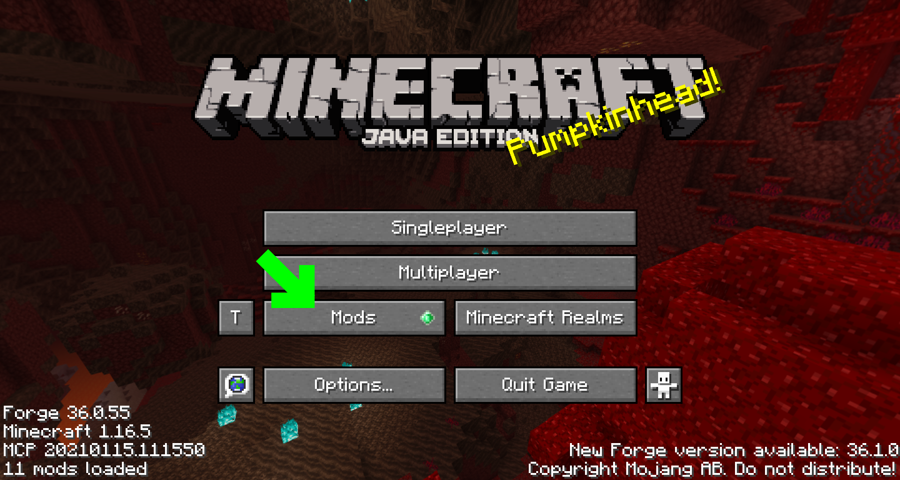
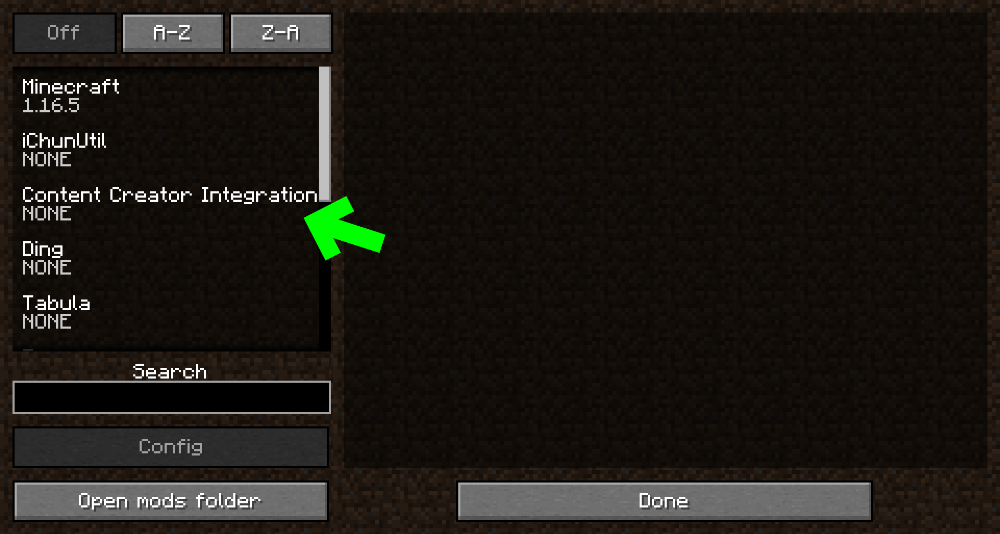
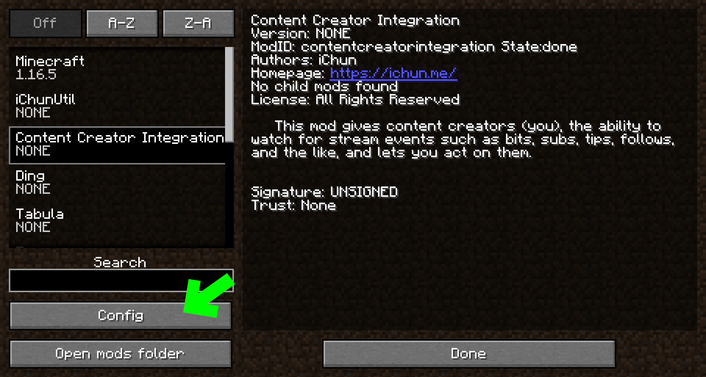
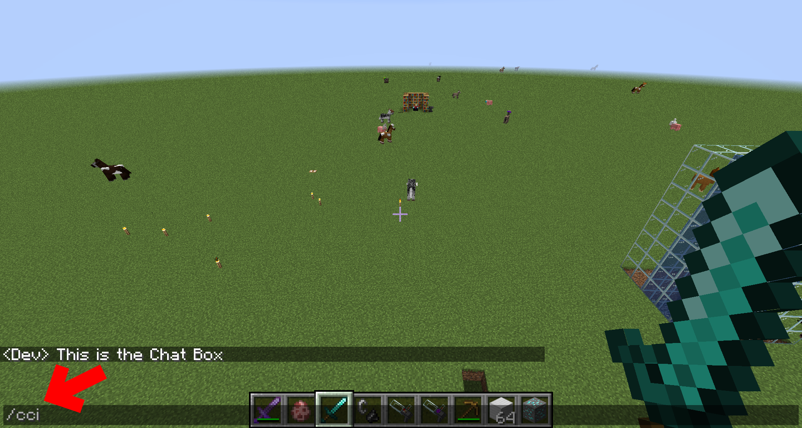
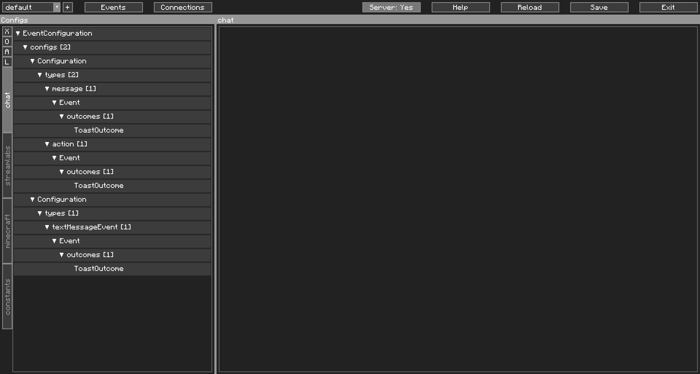
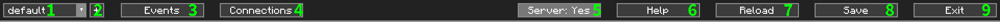
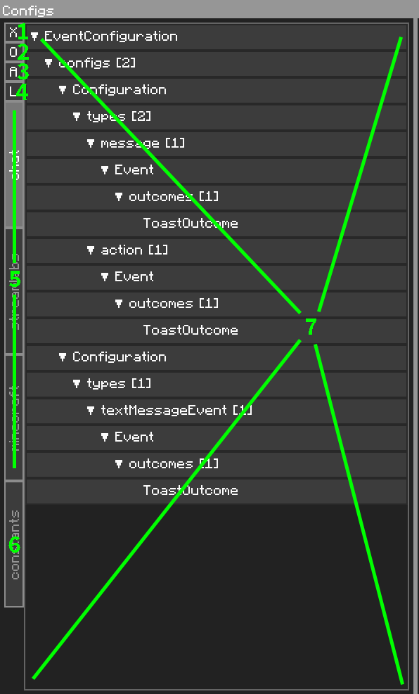
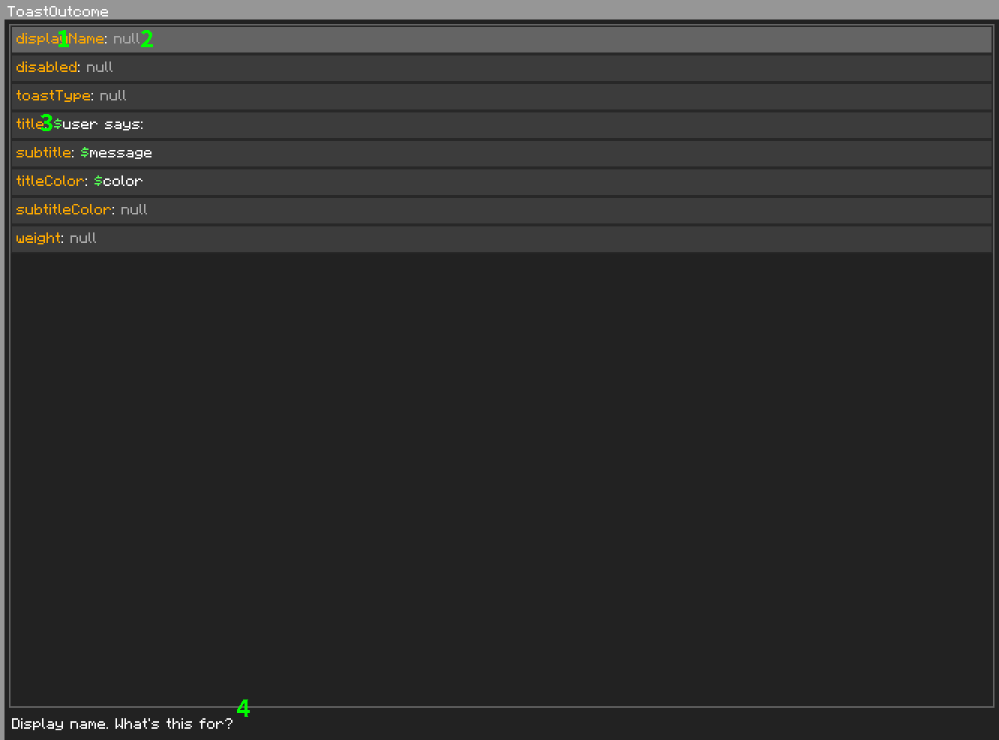

The CCI Editor
==============

Accessing the CCI Editor
------------------------

Most of CCI's configuration will be done through the editor. More advanced users may edit the JSON files directly, with care not to break JSON's strict formatting.

The editor can be accessed in two different ways:
1. Through the mod list screen.
2. Via a command in-game.
&nbsp;

#### The Mod List Screen

1. Hit the `Mods` button in the Main Menu

{: class="img_center"}
 
 

2. Find `Content Creator Integration` in the Mods list and click on it.

{: class="img_center"}
 
 

3. Click on the `Config` button.

{: class="img_center"}
 
 

#### In-game Command

1. Open chat and type in `/cci`. Do not put in any arguments, and hit `Enter`.

{: class="img_center"}
 
 

The CCI Editor
==============

This is the CCI Editor. This is where you will spend most of your time setting CCI up. If things look a little squashed, you may have to increase the size of your Minecraft window. There is a **lot** to show here.

{: class="img_center"}
 

Here is a numbered picture and a description of what each element does.

The Toolbar:
{: class="img_center"}

| No. | Name                  | Description                                                  | Additional Info                                                           |
|-----|-----------------------|--------------------------------------------------------------|---------------------------------------------------------------------------|
| 1   | Profile Selector      | Opens a dropdown to select a profile                         |                                                                           |
| 2   | New Profile           | Opens a prompt to add a new profile                          | Shift-clicking will open your profile directory. Ctrl-clicking will let you rename your current profile.                           |
| 3   | Event Viewer          | Opens the Event Viewer                                       | Shift-clicking will hide the variable values when opened                  |
| 4   | Connections Window    | Opens the Connections Window                                 | Allows you to disconnect or reconnect your sockets                        |
| 5   | Server-able Indicator | Shows if you can do server-side outcomes. More on this later |                                                                           |
| 6   | Help Window           | Opens the Help window                                        | Also has buttons for statistics, the setup wizard, and debug mode         |
| 7   | Reload Configurations | Reloads all configuration files from disk                    | Only useful if you edit your files by hand                                |
| 8   | Save Configurations   | Saves and applies all your configuration files if changed    |                                                                           |
| 9   | Exit Button           | Exits the Editor GUI                                         | Shift-clicking saves (and applies) all your configurations before exiting |

 
 

The Navigator:
{: class="img_center"}

| No. | Name                  | Description                                                  | Additional Info                                                            |
|-----|-----------------------|--------------------------------------------------------------|----------------------------------------------------------------------------|
| 1   | Collapse All          | Collapses all the navigational trees in #7                   |                                                                            |
| 2   | Expand All In Current | Opens all the navigational trees for the selected object     |                                                                            |
| 3   | View Specific Config  | For use of viewing a specific config                         | Use this if your config list is so long it goes off screen                 |
| 4   | View Specific Library | To view the contents of a specific library                   | Libraries will be explained in detail later                                |
| 5   | Event Configurations  | List of event configurations                                 | Also known as configs                                                      |
| 6   | Constants             | View constants                                               |                                                                            |
| 7   | Navigational Area     | Tree-style navigation for navigation                         | You cannot edit anything here. Only navigate. Editing is on the right side |

 
 

In our example, this window was blank. We've selected something to show in this screenshot to help explain...  
The Content Editor:
{: class="img_center"}

| No. | Name                          | Description                                            | Additional Info                                                                                            |
|-----|-------------------------------|--------------------------------------------------------|------------------------------------------------------------------------------------------------------------|
| 1   | Field Name                    | The name of the field in the object you have selected  |                                                                                                            |
| 2   | Field Value                   | The value of the field in the object you have selected | If `null`, the text is greyed out. What is [null](https://www.quora.com/How-can-I-explain-the-concept-of-null-to-a-non-programmer)? |
| 3   | Variable Marker               | A variable marker                                      | For readability                                                                                            |
| 4   | Description of Selected Field | Describes what the selected field is for               | Description. Of. Selected. Field. Was this additional info really necessary? If you thought No, you're wrong. |
