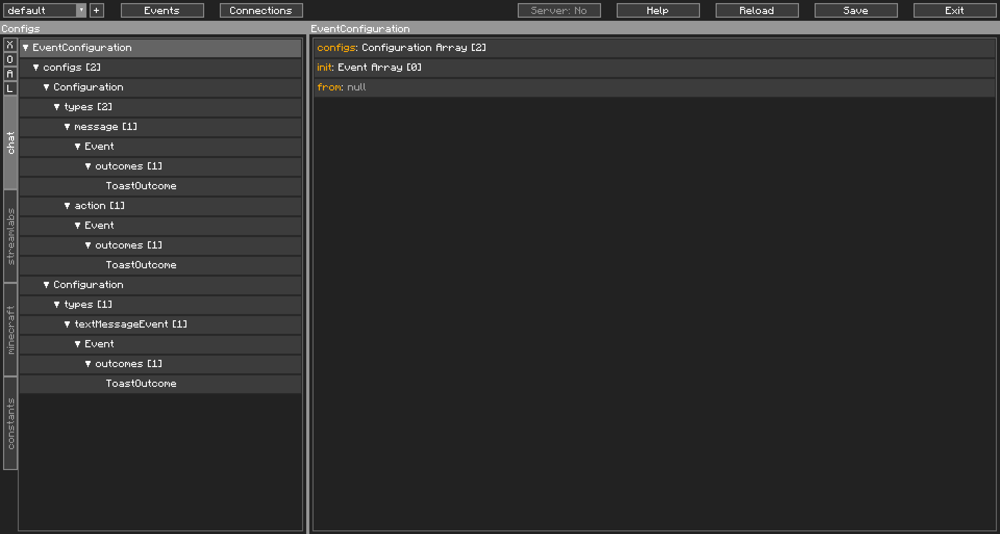
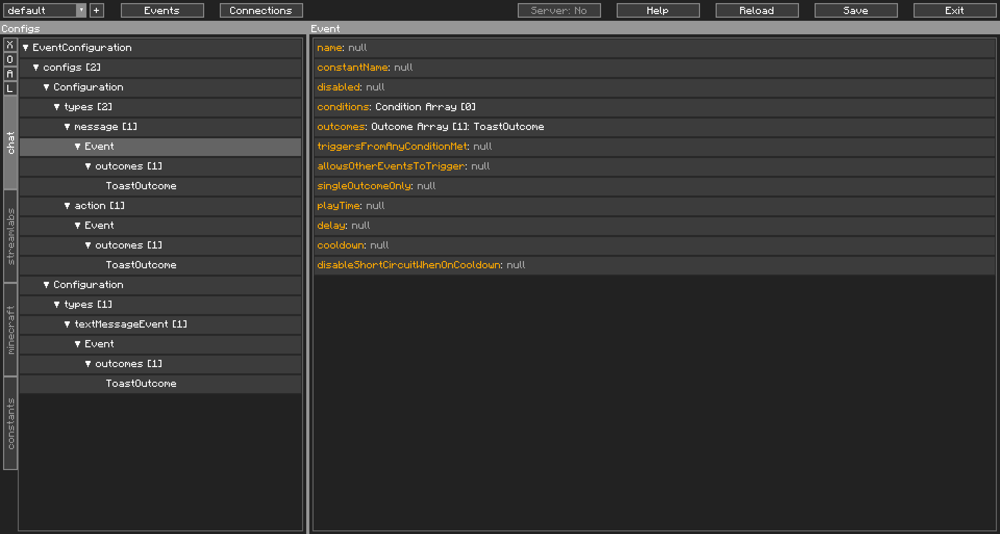

The Anatomy of an Event Configuration
=====================================

Now that we understand what events are, let's talk about how they are processed. Each socket layer has their own Event Configuration (with the exception of Chats, which all share the same Event Configuration). CCI does the hard work of breaking down a Stream Event into an Event, understands its type, and then passes it to an Event Configuration to be processed. These Event Configurations are what I commonly refer to as a "config", and these are saved in your profile folder as JSON files.

Let's take a look at an Event Configuration as it appears in the Editor. In this example, we used the default Event Configuration generated for Chat:

{: class="img_center"}
 
 

| Reminder                                                                                                                                                      |
| ------------------------------------------------------------------------------------------------------------------------------------------------------------- |
| The left window, the navigator, is only for navigation. You cannot manipulate any of its Objects. That has to be done on the right side, the contents window. |

Similar to our screenshot of the Editor from earlier, now, the Event Configuration has been selected on the left side, by the top. The Contents window on the right now shows the fields of this Object.

Very quickly, you can see the full tree of this Event Configuration on the left, and that this Event Configuration has two Configurations, and no Events on init, on the right.

As Chat's Event Configuration is shared between Twitch and YouTube, one Configuration is used for Twitch, and one Configuration is used for YouTube. For the purposes of this guide, we will be focusing on Twitch's Configuration, the first one in the Navigator.

Twitch chat's stream events generally fall under two categories, a `message` and an `action`. `message` type Stream Events are usually the normal messages you see in chat, and sometimes, channel point rewards that contain text. Differentiating the two will be explained later. `action` type Stream Events are when a user does `/me` before sending a message into Twitch chat.

CCI processes the Stream Event to determine which platform it's from, and what type it is, and then passes this to the Event Configuration, which automatically filters this and then tests it against the Config Events. Here you can see that both `message` and `action` only have one Config Event attached. 

Let's have a look at the Config Event for `message`:

{: class="img_center"}
 
 

There's a lot to take in here, but I want you to focus on three things: `conditions`, `outcomes`, `allowsOtherEventsToTrigger`. 

`conditions` are a list of "conditions" that need to be met for this Config Event to trigger. Having no conditions also causes the Config Event to trigger. When the Config Event triggers, it triggers the outcomes in `outcomes`. Both conditions and outcomes have their own special fields to modify their behaviour, but we won't go into detail here. A Config Event will always need at least one Outcome or else CCI will consider it invalid. In this instance, since there are no conditions, any chat message triggers the `ToastOutcome`, which causes a Toast to pop up with the user's name and message.

This is where it gets a little complicated (as if it wasn't already), the first Config Event for type `message` is tested, and if it triggers, CCI considers this as a job well done, and stops there. If the Config Event doesn't trigger, eg the conditions aren't met, or it is on cooldown, the next Config Event in the list is tested. CCI works on a top to bottom principle, meaning it tries from the top and works downwards. This applies for Config Events, Conditions, Outcomes, and most other things.

So, if this Config Event triggers, CCI stops there, we call this "short circuiting". The Config Events after this aren't tested at all and we stop processing. This is where `allowsOtherEventsToTrigger` comes in. Enabling this flag, aka turning it to `true`, will continue the processing even after this Config Event triggers. 

"*But why?*". There are many different applications for this. You might want a Config Event to handle all incoming chat messages, before letting other Config Events process this, for example. "*But why not just do that all the time?*". That, is a waste of resources, and we all know how intensive playing MC Modded can be, so lets not do that.

So, in summary, the flow:
`Stream Event -> Event -> Event Configuration -> Configuration -> Config Event -> Conditions & Outcomes`

This outlines the basics of how an Event Configuration works. There are more advanced applications for these, but these will be detailed elsewhere. Next, we will detail on how to handle an Event.
