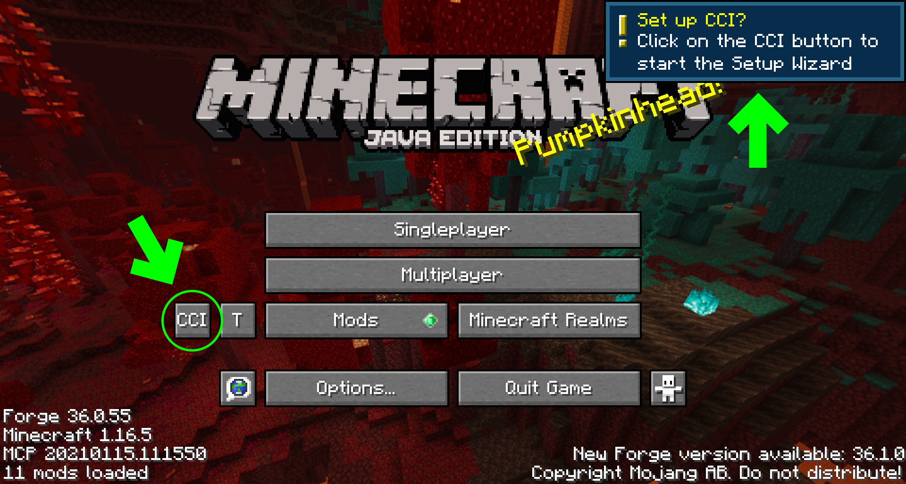
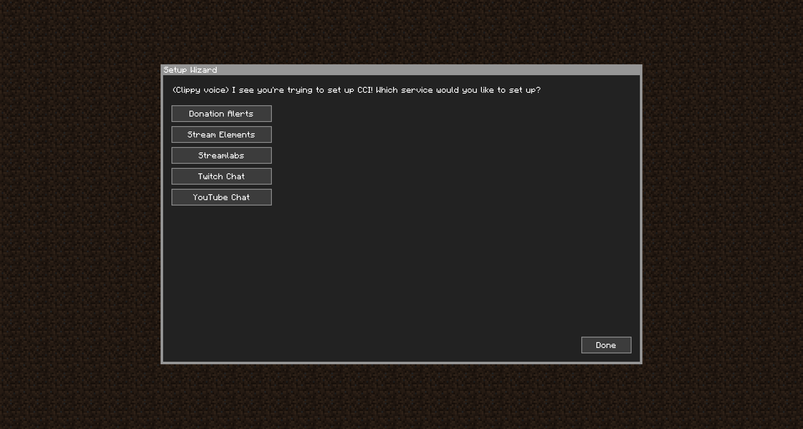
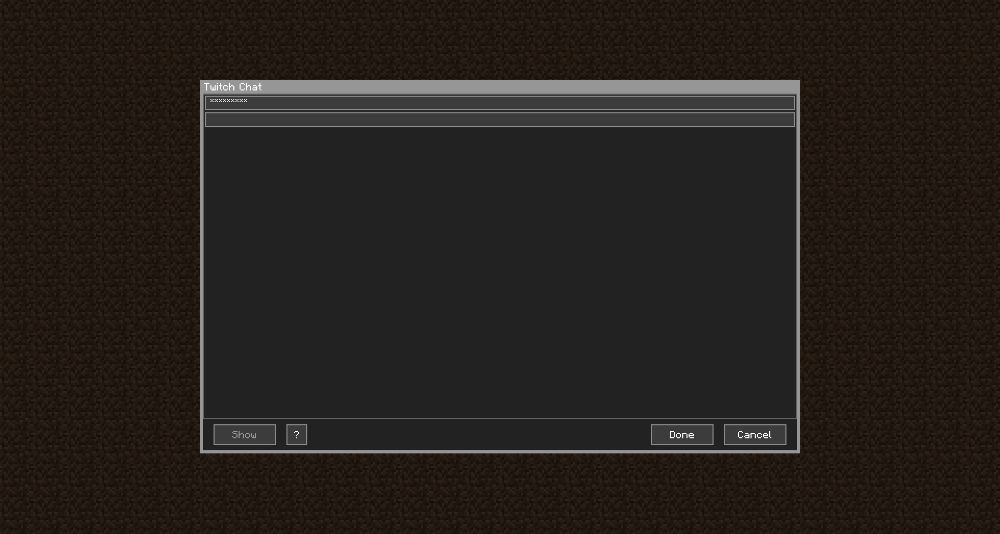
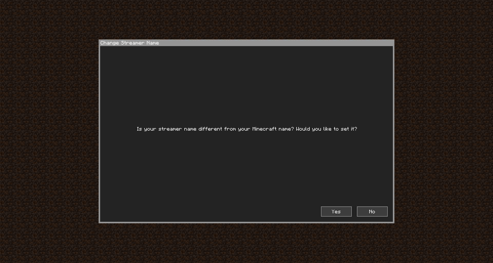

Getting Started
===============

Before We Start
---------------

As these docs are focused on working with CCI, no info will be given on how to install it. Install CCI as you would any other mod, for whichever launcher you are using. Many tutorials exist for these, look them up elsewhere.
&nbsp;

### The Mod Configuration File

CCI as a mod works primarily on the client, with installation on the server, although recommended, is optional.

What this means is that the mod configuration files are not interchangeable. Client mod config will not work on the server, and vice versa.

If you would like to read more on installing CCI on a server, [read here](./ccionservers/).
&nbsp;

### Important Distinctions

Throughout these docs there will be a couple of mentions of similarly sounding phrases. This is the list of important distinctions and differences between the similarly sounding phrases.

| Phrase       | Definition                                                                                                                                                                                                                                           |
| ------------ | ---------------------------------------------------------------------------------------------------------------------------------------------------------------------------------------------------------------------------------------------------- |
| Stream Event | These are events that happen on stream. Subscriptions, cheers, chat messages, etc                                                                                                                                                                    |
| Event        | These are stream events that are processed and passed on to you to process. More on this later.                                                                                                                                                      |
| Config Event | These are events configured in CCI to act on the aforementioned Events, stored in an Event Configuration. These contain conditions, outcomes, etc. These may also be referenced as just `Event`. Understand which Event type is being referenced through the context. More on that later. |
|          |                                                                                                                                                                                                                                                      |
| Mod Config   | The mod configuration file used to configure the mod. These contain your socket keys and should never be shown to others.                                                                                                                            |
| Config       | The configuration files CCI uses to understand what to do with your Stream Events. These collectively form Events and are saved in JSON files.                                                                                                       |

First Launch
------------

When launching CCI on the client for the first time, you should be prompted with a toast asking if you would like to set up the mod.

{: class="img_center"}
&nbsp;

Clicking on the `CCI` button (in the green circle) should open up the First Launch Setup Wizard.

{: class="img_center"}
 
 

Click on any of the buttons for the services to add a registry for that service. If you're not sure which service to use, have a read [here](./socketdifferences/). The input window will look similar to this. To find the key for the service you've selected, we have instructions on a different page. Check the sidebar for your selected service's page (if available).

In this example, we're using a Twitch Chat and already have one channel name added. One key per line.

{: class="img_center"}
 
 

Once you hit `Done`, you will be taken back to the services list. If you're done adding services, hit `Done` again. You may notice a bunch of toasts pop up indicating that CCI is attempting to connect to those services.

You will now be asked if your streamer name differs from your Minecraft In-Game Name.

{: class="img_center"}
 
 

Hitting yes will allow you to set your streamer name, which will affect your `$streamerName` variable. More on [Variables](./events/#variables) later.

Once you are done, you should be back at the main menu. There may be some additional [mod config](./clientconfig/) settings you may want to change, but for the purposes of this guide, those won't be necessary.
