Processing an Event
===================

In this example, we will run you through setting CCI up to act on a Channel Point Reward on Twitch, using Twitch Chat. How CCI captures a Channel Point Reward is by requiring text, so that it comes through chat. Those chat messages have an additional variable to indicate that it's a Channel Point Reward, and this tutorial will walk you through setting that up. There is a separate tutorial for getting this to work with [Twitch PubSub](../../howto/twitchchannelpointreward/).

If you already have a Channel Point Reward, be sure to force it to require text, and skip ahead to the CCI segment.

## Making the Channel Point Reward

I am presuming you already know how to get to your Channel Point Rewards in your Twitch Dashboard, so I will be skipping that bit.

1. Click on `Add New Custom Reward`, and edit the fields to your liking. Be sure to require the viewer to enter text. CCI needs this. This is the example we will be using:

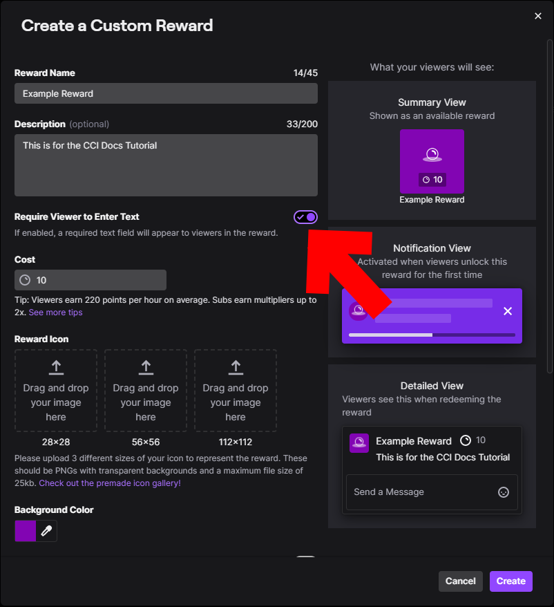{: class="img_center"}
 
 

## Getting the Information Needed and Setting Up CCI

1. Launch up CCI and open up the Editor. 

2. In your Twitch Chat, claim the channel point reward.

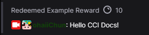{: class="img_center"}
 
 

3. In CCI's Editor, open up the Event Viewer. That's the `Events` button on the top left. In the `Chat` layer, look for a variable called `custom-reward-id`. We will want both the name and the value. In this example, the value is `a54f1f3d-e05d-46e8-aea9-0285ab9d0266`. Note how `cci-type-event` is `message`.

| Reminder                                                                                                     |
| ------------------------------------------------------------------------------------------------------------ |
| Click on the Variable listing, and hit Ctrl+C to copy the variable name, Ctrl+Shift+C for the variable value |

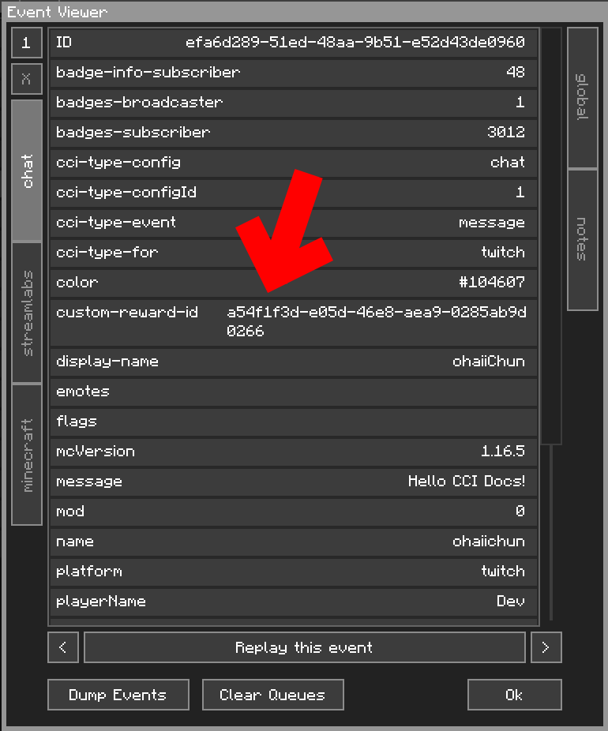{: class="img_center"}
 
 

Optional. Go to the existing Config Event and name it `Toast`. This will be helpful later.

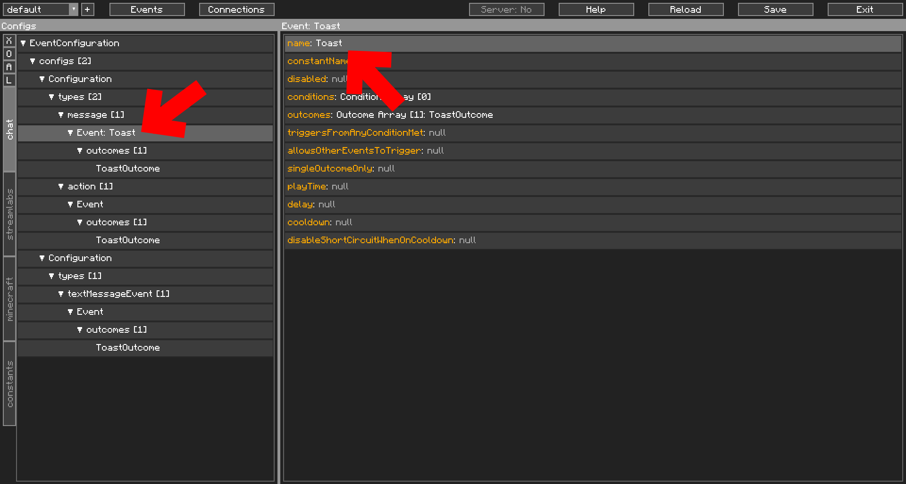{: class="img_center"}
 
 

4. Go to `message` in the Navigator. Double-click in the Contents window to add a new Config Event. From there, click and drag the first event, `Event: Toast`, down to below the new Event. We want our Channel Point Reward Config Event to trigger first.

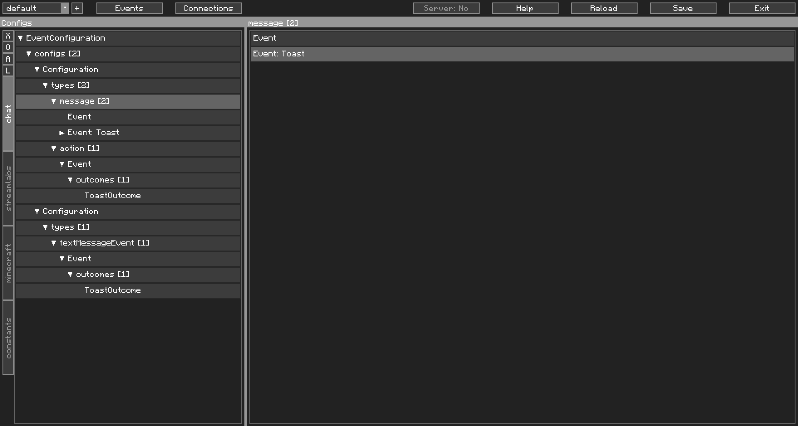{: class="img_center"}
 
 

5. Click on the new Config Event you just created in the Navigator. *(Optional)* Name it `Example Reward`.

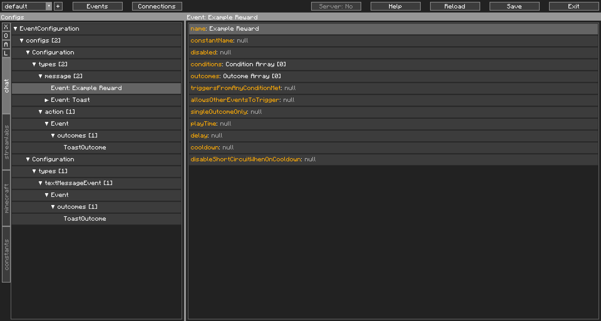{: class="img_center"}
 
 

6. Double-click on `conditions` to open up the window to add a new Condition. Find `variableCheck` or `VariableCondition` and add it. 

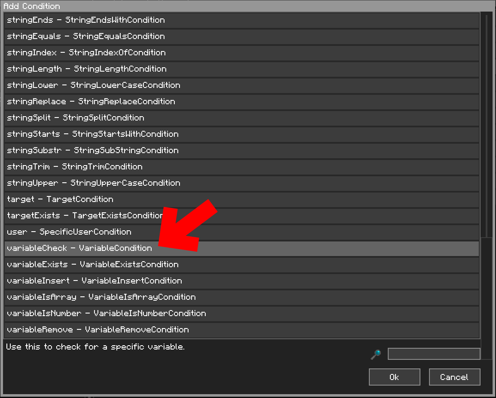{: class="img_center"}
 
 

7. Open up the `conditions` tree in the Navigator. Note how `VariableCondition` is red. This means it is invalid, and that CCI will not load it, if saved. We will fix that in a bit. Click on it.

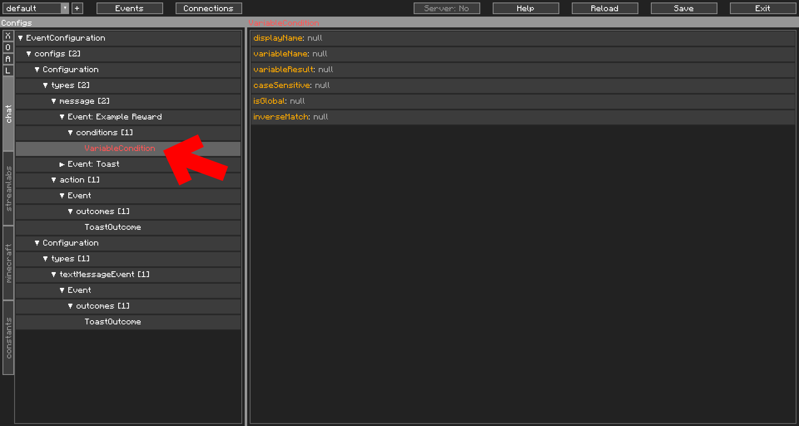{: class="img_center"}
 
 

8. In `variableName`, set it to the variable name we got earlier, which was `custom-reward-id`. In `variableResult`, set it to the value we also got earlier. Our example's is `a54f1f3d-e05d-46e8-aea9-0285ab9d0266`. Note how when these two were filled in, `VariableCondition` in the Navigator is no longer red.

| Protip                                                                                                          |
| --------------------------------------------------------------------------------------------------------------- |
| You can select some fields and paste (Ctrl+V) directly into it, rather than double clicking to open the editor. |

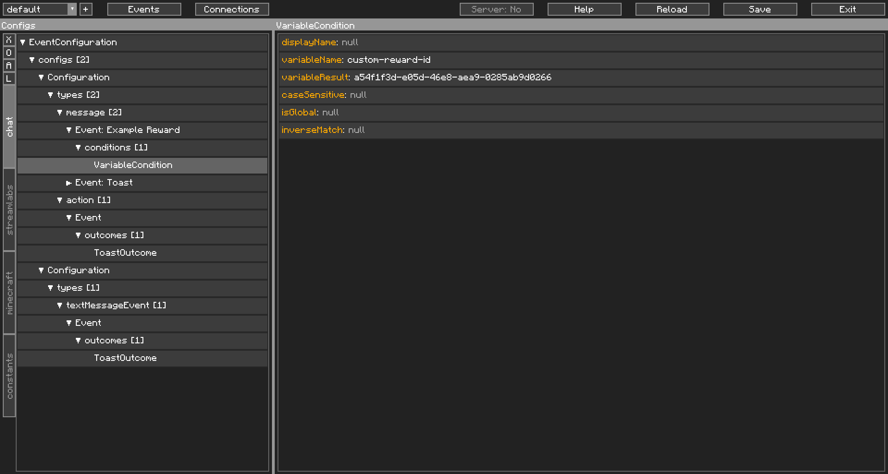{: class="img_center"}
 
 

9. Now, go back to the Config Event. Now we add an Outcome. This is where you customise your Outcomes to what is defined in your reward, but for this guide's purposes, we'll use another `ToastOutcome`. Double-click `outcomes` and add a `ToastOutcome` (id: `toast`).

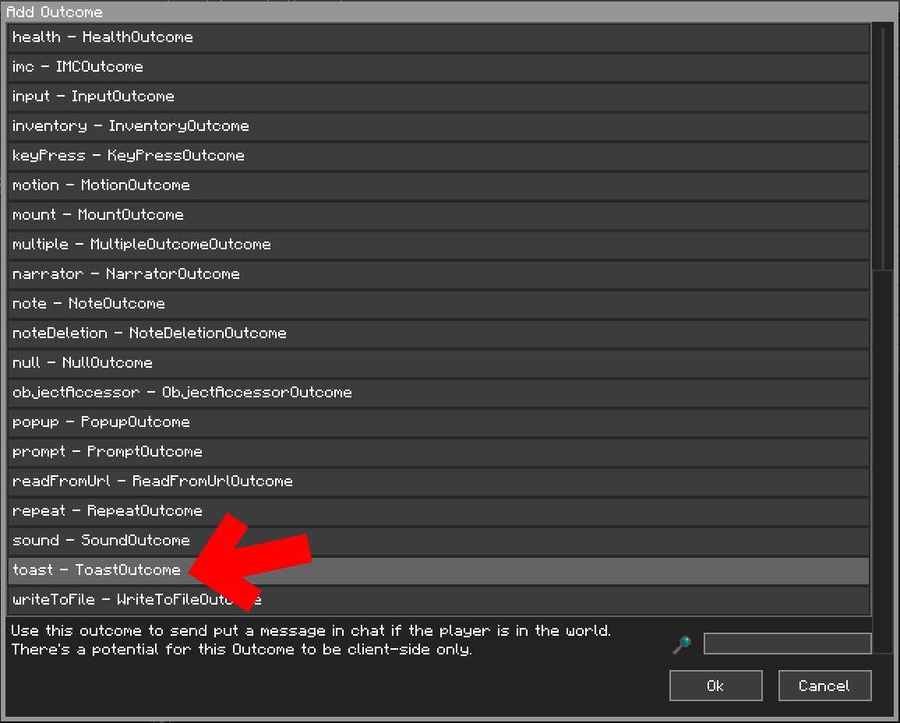{: class="img_center"}
 
 

10. Navigate to the `ToastOutcome`. Set the `toastType` to `2`. Now we show how Variable insertion comes in. Recall from Step 3 where there was a variable called `display-name`. We will be using that here.

    Set `title` to `Example Reward Claimed!`, and `subtitle` to `Claimed by $display-name`. Note how CCI marks all `$` as green, to help you notice variable insertions.
    
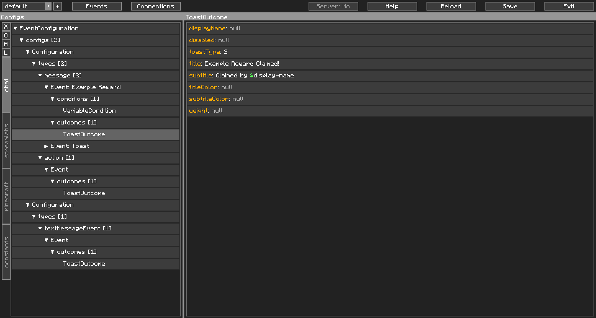{: class="img_center"}
 
 

11. Go back to your Config Event. We're not done yet. We still want the message to be processed by the other Config Event. Double-click on `allowsOtherEventsToTrigger` to set it to `true`.

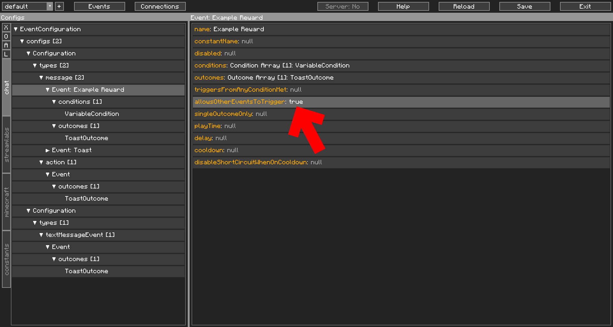{: class="img_center"}
 
 

12. Hit `Save` on the top right. Your updated Event Configuration is immediately applied. Try to claim your Channel Point Reward and if you followed our example, watch as two Toasts pop up.

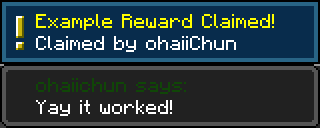{: class="img_center"}
 
 
 

And that concludes our tutorial. Hopefully this Getting Started segment has helped you understand how CCI works and how to use it. The other pages in this segment are additional tidbits that are worth reading, but the basics are done. For more reading, check out the Intermediate and Advanced section in the sidebar, or check out the How To's section for more targeted approaches.

**Good luck** getting things working the way you want it to, _this is only the beginning_. 

If you are happy with what the mod does and if this guide has been helpful, do consider giving me a tip via the `Donate` button in `About Project` on the [CurseForge page](https://www.curseforge.com/minecraft/mc-mods/content-creator-integration/).
