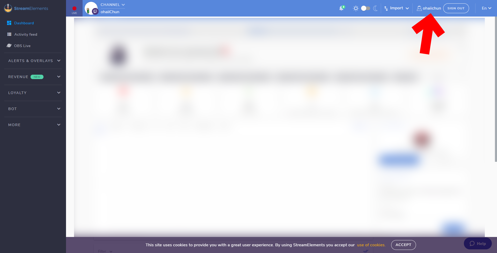
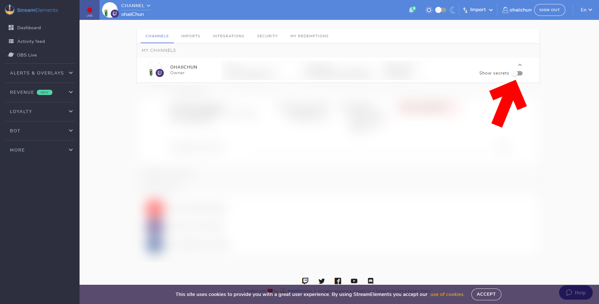
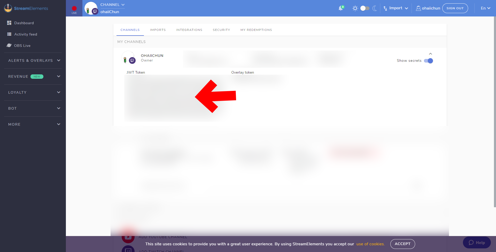

Finding Your StreamElements JWT Token
=====================================

| Protip |
|--------|
| Playing Test Events work with CCI, but isn't always representative of a live event. StreamElements test events trigger multiple times for multiple listeners, which never happens when live. Always use live events when making configs where possible. |

 
 

1. Go to your StreamElements dashboard and click on your profile name in the top right.

{: class="img_center"}
 
 
2. In the Channels tab, click on the Show secrets button.

{: class="img_center"}
 
 
3. And there's your JWT Token. Copy that, it's what CCI needs.

{: class="img_center"}
