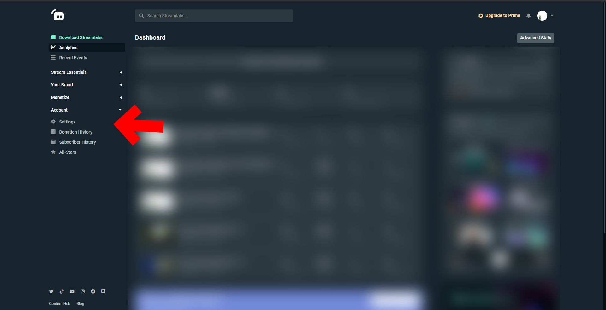
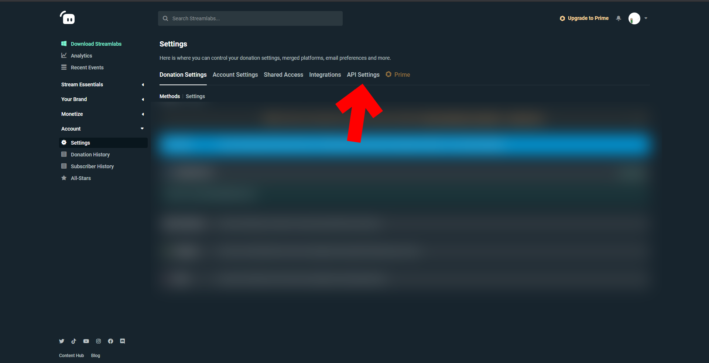
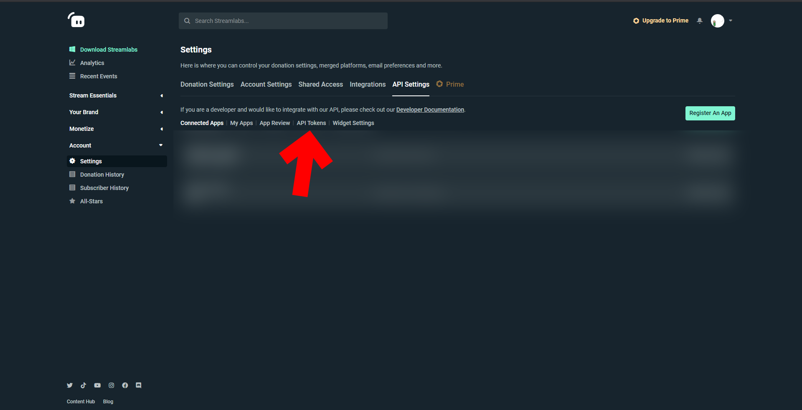
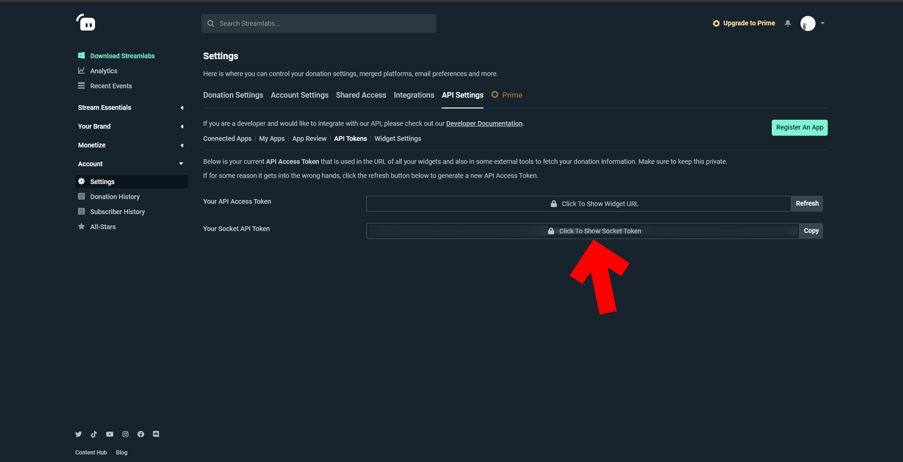

Finding Your Streamlabs Socket.IO API key
=========================================

| Protip |
|--------|
| Streamlabs usually needs one of their sockets active before they begin transmitting to other third party sockets. I recommend having one of their widgets open during your stream, such as their Event List widget. |

| Protip |
|--------|
| Replaying events through the dashboard works with CCI, but isn't always representative of a live event. Always use live events when making configs where possible. |

 
 

1. Go to your Streamlabs dashboard and click on Settings in the left sidebar, under Account

{: class="img_center"}
 
 
2. In the Account Settings page, click on API Settings

{: class="img_center"}
 
 
3. In The API Settings page, click on API Tokens

{: class="img_center"}
 
 
4. And there's your Socket API Token. Copy that, it's what CCI needs.

{: class="img_center"}
