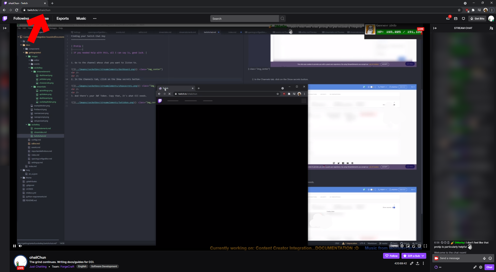
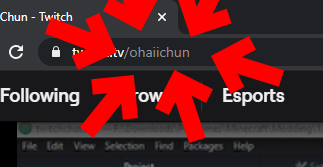

Finding Your Twitch Chat Key
============================

| Protip |
|--------|
| If you needed help with this, all I can say is, good luck. |

 
 

1. Go to the channel which chat you want to listen to.

{: class="img_center"}
 
 
2. In the URL, copy the bit that's after `twitch.tv/`. If there is a `?` like `?referrer=raid`, remove everything after the `?`, including the `?`. Just the channel name is what CCI needs.

{: class="img_center"}

Please don't literally copy `ohaiichun`. That's my channel name. Go find your own.

## Advanced

If you also have an OAuth token with `chat:read` and `chat:edit` scopes, you can append them to the channel name with a `:`. Eg: `ohaiichun:<oauth_token>`.
