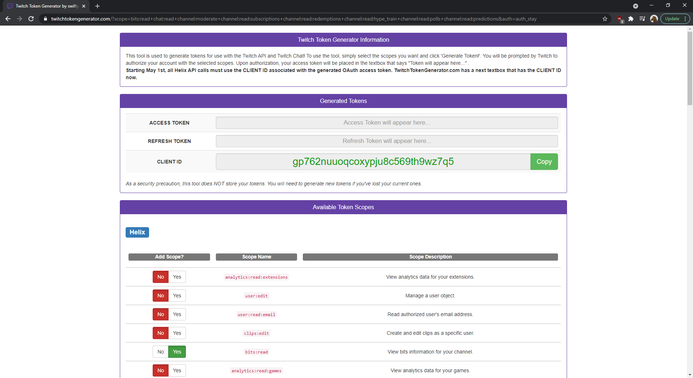
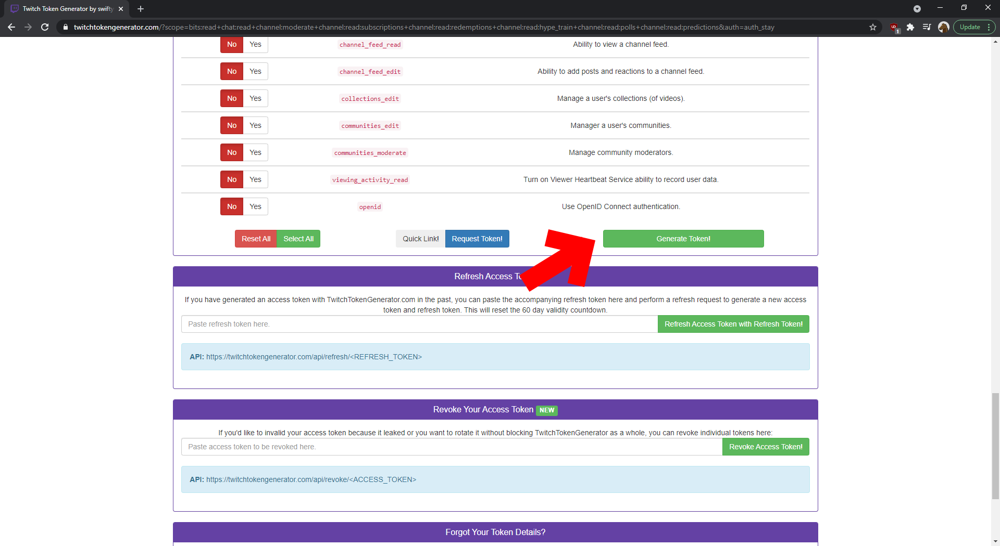
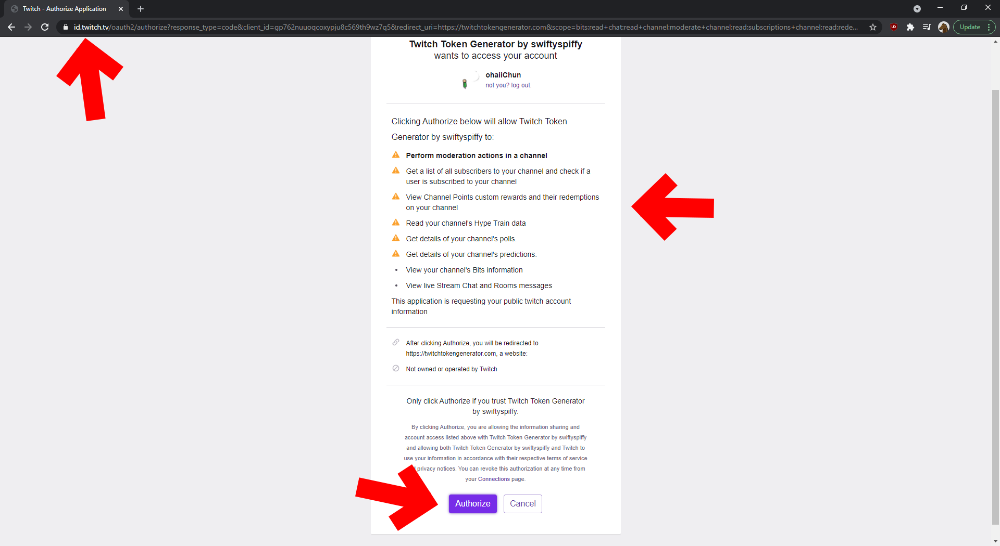
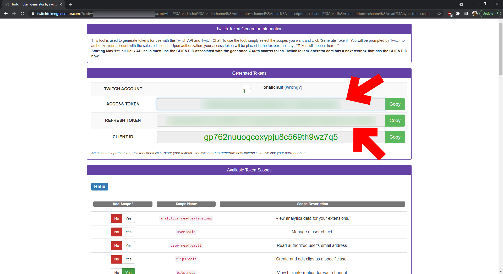

Getting Your Twitch PubSub OAuth Token
======================================

| Note                                                                                                                                                                                                         |
| ------------------------------------------------------------------------------------------------------------------------------------------------------------------------------------------------------------ |
| PubSub support is the newest and least documented support that CCI has and may be subject to change. I don't even know how long the OAuth keys last, so consider this your warning that things can go wrong. |

 
 

## The OAuth Token, and its Scopes

If you've made a chat-bot before, you might be a bit familiar with making an OAuth token with custom scopes. If you haven't, no worries, I'll walk you through it the whole way nonetheless.

CCI requires a set of specific scopes to listen to specific topics. What this means is that you have to define those scopes when generating your OAuth token, or else CCI will not be able to listen to those topics.

| Scope                               | Topic |
| ----------------------------------- | ----- |
| `bits:read`                         | `channel-bits-events-v2` `channel-bits-badge-unlocks` `channel-bit-events-public` `channel-cheer-events-public-v1`      |
| `chat:read`                         | `user-moderation-notifications`      |
| `channel:moderate`                  | `chat_moderator_actions` `automod-queue`      |
| `channel:read:hype_train`           | `hype-train-events-v1.rewards` `hype-train-events-v1`      |
| `channel:read:polls`                | `polls`      |
| `channel:read:predictions`          | `predictions-channel-v1`      |
| `channel:read:redemptions`          | `community-points-channel-v1` `channel-points-channel-v1`      |
| `channel:read:subscriptions`        | `channel-subscribe-events-v1` `channel-sub-gifts-v1`      |
| Scope uncertain, possibly not required | `leaderboard-events-v1.bits-usage-by-channel-v1` `leaderboard-events-v1.sub-gifts-sent` `following` `raid` `celebration-events-v1`      |

These are the topics that CCI listens to. If you leave any scope out in your OAuth token, those topics will not be listened to when CCI runs. If you know the right scope a certain topic belongs to, do not hesitate to correct this guide.

 

## Generating the right OAuth Token

So, we're going to need an OAuth token. I personally used `twitchtokengenerator.com`, and have made a [quick link](https://twitchtokengenerator.com/quick/jIAulxmVAS) with the set scopes for you to use. When you get there, it will look something like this:

{: class="img_center"}
 
 

Scroll down, check the scopes if you want to, and click on `Generate Token!`

{: class="img_center"}
 
 

Click on that, and here you'll be taken to the Twitch page to authorize. Be sure to check the domain again and ensure it points to `id.twitch.tv`, double check the Scopes, then hit the Authorize button. CCI isn't responsible if something happens to your account because you didn't validate these details.

{: class="img_center"}
 
 

Solve the CAPTCHA if you get one, then you're shown your Access Token (this is your OAuth token), and a Refresh Token. Keep them both somewhere safe, you'll need them in the future. I had to generate a new token just for this guide, so I hope you're happy.

{: class="img_center"}
 
 

And those are your tokens. That's what CCI needs.
