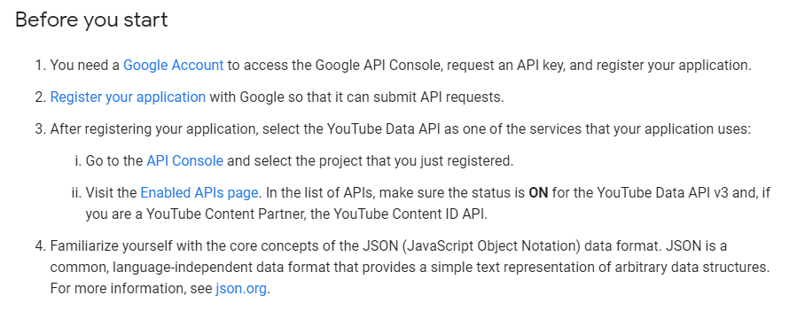
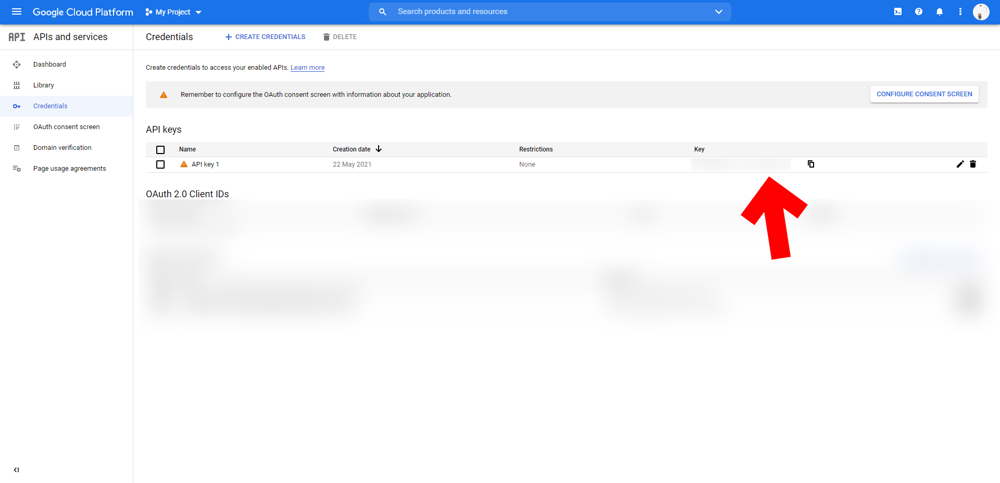
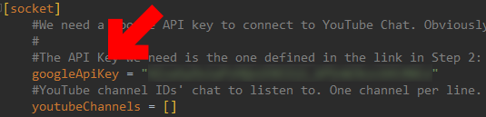
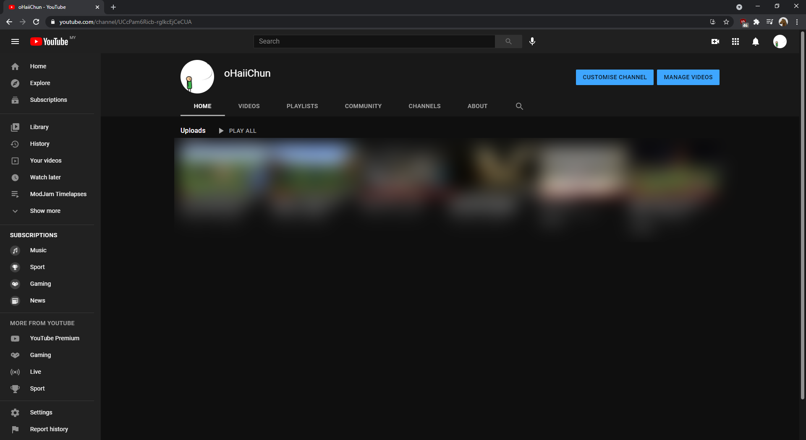
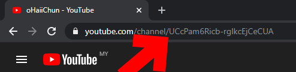

Finding Your YouTube Chat Channel ID
=====================================

| Protip |
|--------|
| YouTube Chat support is a little special. You need to first generate an API key from Google. |

 
 

### Google API Key

YouTube Chat support first requires an API key. This is a one time set up. If you already have an API key, skip to getting the channel name.

1. Go to this [URL](https://developers.google.com/youtube/v3/live/getting-started#before-you-start), and read the `Before you start` section. Follow steps 1 - 3. Step 4 is optional but helpful as CCI also uses JSON.

{: class="img_center"}
 
 

2. Go back to Step 2 and click on the `Register your application`, then find the URL to open your `Credentials page`, or open it directly from Google Cloud's APIs and Services page. You should see something similar to this image. Copy out the key.

{: class="img_center"}
 
 

3. Open CCI's mod config file in `/config/contentcreatorintegration/` in your Minecraft install and find the `googleApiKey` field in the `socket` category. Put the key you copied there. Don't forget the quotes.

{: class="img_center"}
 
 

### YouTube Channel Name

1. Go to the channel which chat you want to listen to. (Alternatively, click on your profile picture in the top right and click `Your channel` in the dropdown)

{: class="img_center"}
 
 
2. In the URL, copy out the channel ID. It's the part that starts with `UC`. If the URL points to `youtube.com/user/<user>`, that is fine too, but we'd prefer you find the channel ID. This is what CCI needs.

{: class="img_center"}

| Trivia |
|--------|
| I tested this by using Al Jazeera's news broadcast video. Their chat was...interesting. |
