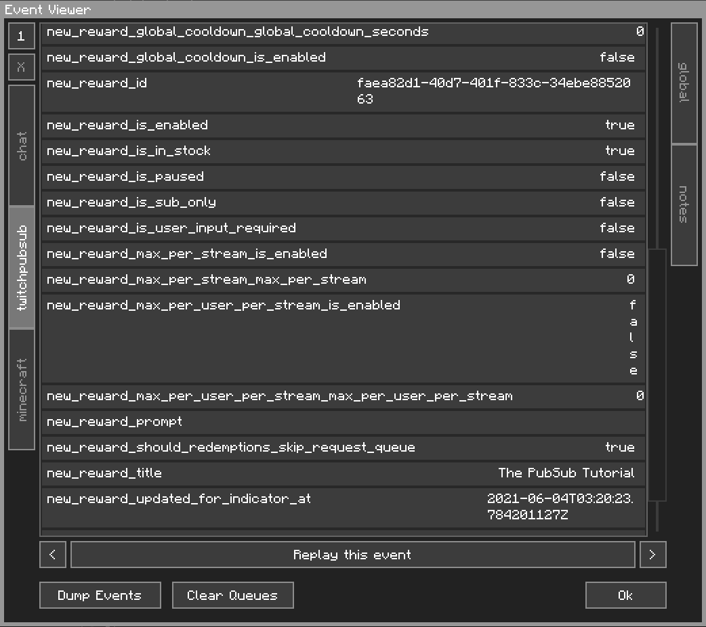
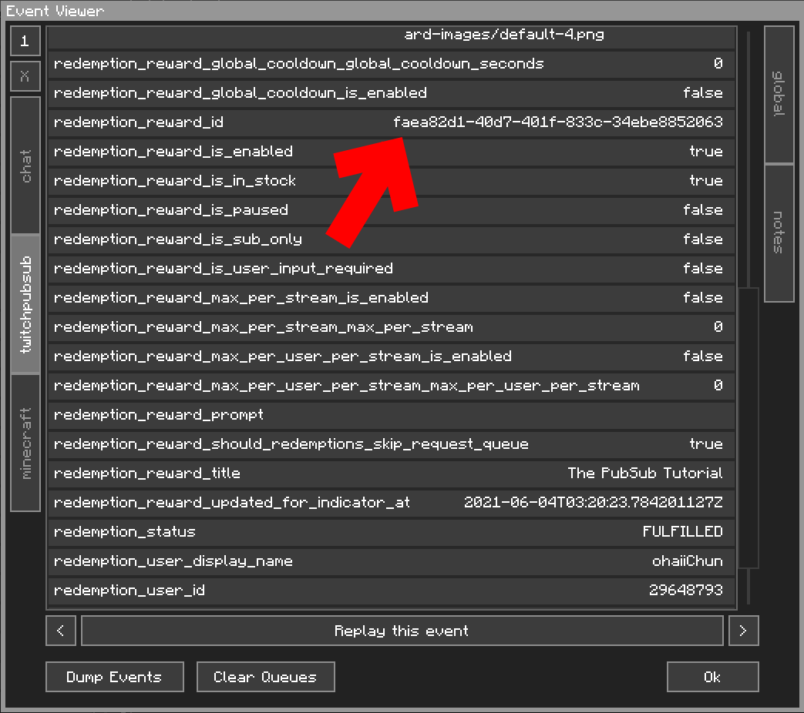
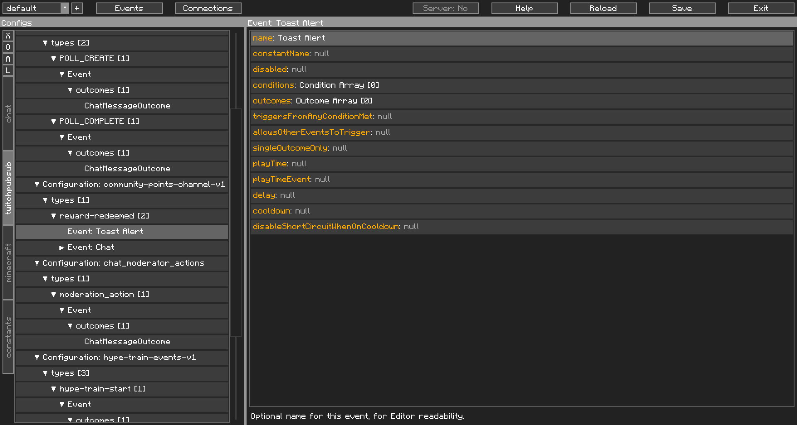
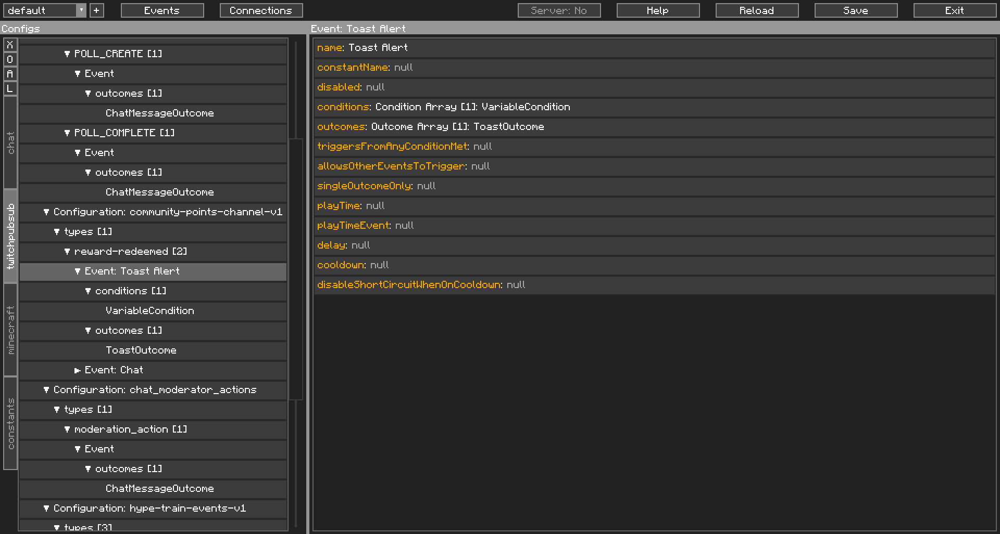
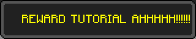

How to&#58; Capturing Twitch's Channel Point Rewards
================================================

Look at you, going at 200 miles per hour. 

Capturing Twitch's Channel Point Rewards was explained in our [Getting Started guide](../gettingstarted/processingevent/). 

If you're here for the PubSub tutorial, wondering why this is separate, it was our Getting Started tutorial, okay? Let's keep it simple there. PubSub spits a lot more information that you might not need.

## The PubSub Tutorial

If you get stuck or confused anywhere during this tutorial, it might be worth going back to the Getting Started section and going over that again. This tutorial presumes you have completed and understood the information in that section.

Have Minecraft opened and CCI connected to PubSub first. If you haven't created your Channel Point Reward, go make it, we don't need text input if we're using PubSub. Now claim your reward and check your Event Viewer.

| Protip |
| ------ |
| You can drag the edges of the Event Viewer window to resize the window.       |

Notice how we had an event trigger when we created the Reward, of event type `custom-reward-created`:

{: class="img_center"}
 
 

Anyway, this isn't what we want, let's look at the event when we claimed the reward, type `reward-redeemed`:

{: class="img_center"}
 
 

We need the variable `redemption_reward_id` and the ID itself.

| Reminder                                                                                                     |
| ------------------------------------------------------------------------------------------------------------ |
| Click on the Variable listing, and hit Ctrl+C to copy the variable name, Ctrl+Shift+C for the variable value |

From here, what you're going to be doing is essentially the same as in our Getting Started guide, from Step #4 onwards, with a few differences.

Because we're not in the Getting Started section anymore (and because I've been writing guides for like a week at this point and I'm getting lazy), the next couple of steps will be more concise than the Getting Started counterpart.

"4". Go to the `reward-redeemed` type in the `community-points-channel-v1` Configuration, name the Config Event already there as `Chat` and add a new Config Event and name it `Toast Alert` and move it above the previous one:

{: class="img_center"}
 
 

Also like the Chat counterpart, we're going to need to listen to `redemption_reward_id` and the ID itself, so go ahead and put those in a `VariableCondition`. For the Outcome, you got it, a `ToastOutcome`

{: class="img_center"}
 
 

This time, we wanna consider the event done, so we will not turn on `allowsOtherEventsToTrigger`. Let it short circuit there.

Test it out: You got infinite Channel Points anyway aaaaaand there's your Toast. *Voilà.*

{: class="img_center"}
 
 
