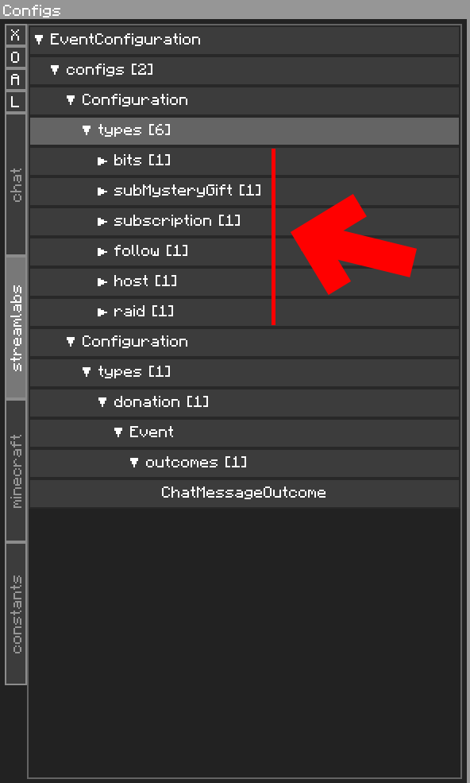
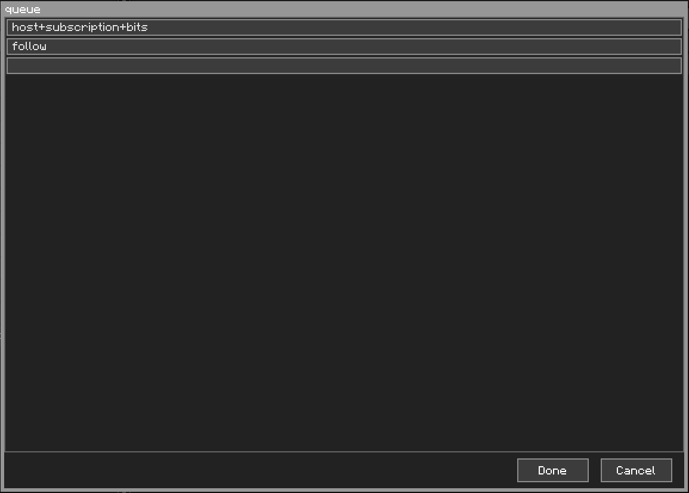
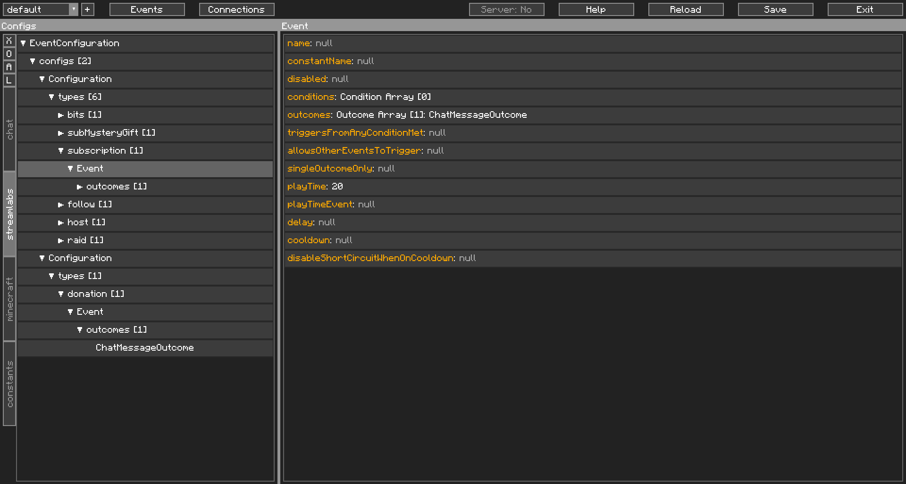
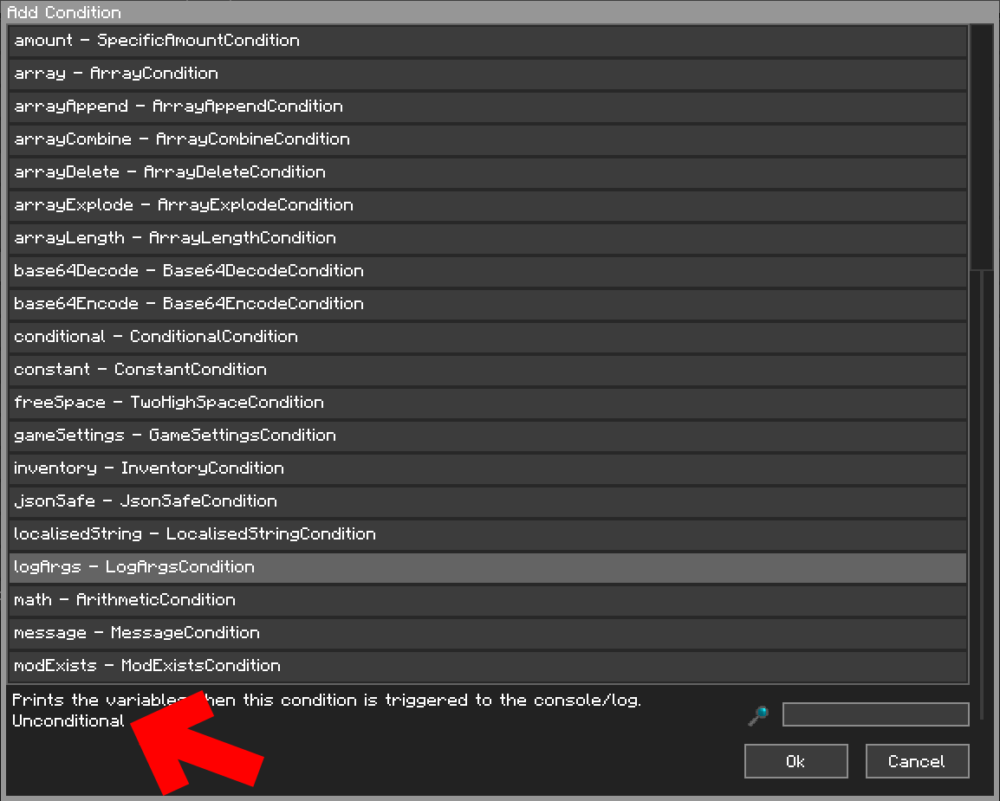

Getting the Most Out of Your Event Configuration
================================================

Whilst going through the Getting Started section, I'm sure you noticed a lot of other fields in the various components of the `EventConfiguration`.

This page hopes to list them in more detail, and their functions.

## EventConfiguration

Nothing much of note here. There is the `init` array, which can be used to set certain variables when the `EventConfiguration` is loaded, and is normally used along with `Constants`. This is covered in more detail [there](../../advanced/eventinit/).

## Configuration

### Event Type Filter (name: `types`)

We already covered this in our Getting Started section, but this bit deserves special mention. If the event type is set to `all` (case sensitive), the Config Events in this type are added **in addition** to the Config Events of the Event's type, and **tested first**.

So, if you want have a Config Event in the `all` type, remember to also enable `allowsOtherEventsToTrigger` to let other Config Events get tested too.

<br />

### Queues (name: `queues`)

Queues work alongside Config Events to allow them to trigger in order, with a set time in between each Config Event, rather than having them trigger their outcomes as they happen. For example, you have an entity spawned when a subscription happens, but then a subscriber gift bomb happens, and suddenly you have 50 angry Witches snarling at you. Queues will stagger them to your predetermined time.

#### Setting up a Queue

First thing first, you need to find out the event type you would like to queue. The default Event Configuration should cover most if not all of the event types you would normally care about. We will be using Streamlabs (and their default Event Configuration) for this example.

{: class="img_center"}
<br />
<br />

In the above picture, you can see that the event types are `bits`, `subMysteryGift`, `subscription`, `follow`, `host`, `raid`. Now, to set up a queue, go to the Configuration. You'll notice the `queue` already has two set. Double click on `queue`

{: class="img_center"}
<br />
<br />

See the `host+subscription+bits` and `follow`? What this means is that there are two queues. `host`, `subscription`, `bits` all share the same queue, and `follow` has a queue of its own. However, just like this, the queues just...*exist*. You have to configure the Config Events to use them.

Move to the Event inside the `subscription` event type. 

{: class="img_center"}
<br />
<br />

Pay attention to the `playTime` field. This has been set to 20 ticks (20 ticks is one second). This event is also of the `subscription` type. What this means is when this Config Event is tested and passes, it gets added to the `host+subscription+bits` queue, triggers if it is the first in queue, and then CCI waits 20 ticks, before triggering the next Config Event in the queue. Be mindful that when Config Events in the queue are triggered, their conditions are not tested again, so their outcomes will be triggered directly. If you need to check a condition when the outcomes trigger, use a `ConditionalOutcome`.

Removing the value of the `playTime` field, or setting it to a value below 0, will make it trigger immediately without joining the queue.

Just before Config Events in the queue are triggered, Global Variables are re-inserted into the variables list, just in case they have changed whilst the Config Event sits in the queue. Because of this, try not to insert any local variables with matching names as global variables, as those will be overwritten.

Also, take note of the `playTimeEvent` field. If this event exists, every tick for the duration of `playTime` (this is after the above Config Event had already triggered), this Config Event is triggered. The variables `currentPlayTime` and `totalPlayTime` are inserted into the variables list, with the current `playTime` tick, and the total play time from the previous event (equivalent to `playTime` from before) respectively. If `currentPlayTime` is equal to `totalPlayTime`, this is the last tick this Config Event will trigger.

<br />

### Ignored Types (name: `ignoredTypes`)

Sometimes, the sockets will spit out jargon that you don't really care about or need. The problem is, this jargon is still an Event and clogs up your Event cache with unnecessary data *(I'm looking at you, streamlabels)*. Setting this to those event types makes CCI just ignore those Events.

<br />

### Platform Filter (name: `for`)

This is a filter that defines what platform this Configuration is for. Eg, in Chat's Event Configuration, we use it to discern between Twitch and YouTube. 

Setting this to `null` disables the filter, and CCI will funnel all Events into this Configuration. Bear in mind that CCI works from a top to bottom principle. If this Configuration is the very first one, all later Configurations are ignored.

<br />
<br />

## Event

Some of these are self-explanatory. I'll detail those that needs special mention.

### Constant Name (name: `constantName`)

Explained in [Constants](../constants/)

<br />

### Single Outcome Only (name: `singleOutcomeOnly`)

Normally, when an event triggers, all of the outcomes are triggered. Turning this on (setting it to `true`), tries the outcomes in order (top to bottom, as usual) until one passes (yeah, outcomes can potentially fail, too), and then it stops there. Randomly selecting an Outcome however, is explained further down, in Outcomes.

<br />

### Delay (name: `delay`)

Adds a delay (in ticks), before triggering the outcomes. Can also work in queues. 

Similarly to queues, after the delay, when Config Events are triggered, their conditions are not tested again, so their outcomes will be triggered directly. If you need to check a condition when the outcomes trigger, use a `ConditionalOutcome`.

Also like queues, just before Config Events are triggered (after the delay), Global Variables are re-inserted into the variables list, just in case they have changed whilst the Config Event waits out the delay. Because of this, try not to insert any local variables with matching names as global variables, as those will be overwritten.

<br />

### Cooldown (name: `cooldown`)

This sets how frequently the Config Event can trigger, in ticks. If the Config Event is tested and passes and it is on a cooldown, it short circuits and CCI stops processing, which leads us to...

<br />

### Disable Short Circuit When On Cooldown (name: `disableShortCircuitWhenOnCooldown`)

Turning this on prevents the short circuit mentioned above and allows other Config Events below it to be tested instead.

<br />
<br />

## Conditions

"Conditions" are a bad name. For the most part, they are indeed conditions, they were developed as such, but eventually there was a need to do other things (eg, functions, math, etc) and it was absorbed into the Conditions system. That leads to a bunch of Conditions being known as "Unconditional".

What this means is that this Condition always passes. You can tell if a Condition is Unconditional by looking at the description when adding a Condition:

{: class="img_center"}
<br />
<br />

This bit only covers Conditions in general, each condition has their own fields and different behaviours. Check them out on their own documentation page.

### Inverse Match / Reverse Result (name: `inverseMatch`)

Inverse match, well, reverses the result. 

Eg, if you're checking if a variable exists, the condition will fail if the variable doesn't exist, and pass if it does. With inverse match, the condition passes if the variable doesn't exist, and fails if it does.

There will be some places where this field is ignored, but not many. Check the documentation of each object you're using to see if it is.

## Outcomes

Similarly to Conditions, this bit only covers Outcomes in general, each outcome has their own fields and different behaviours. Check them out on their own documentation page.

### Outcome Weight (name: `weight`)

Weight only matters when multiple outcomes are pooled together, such as in a Config Event. The weight of each outcome defines how likely the outcome is to be randomly selected. This means a higher weight (compared to the other outcomes), a higher likelyhood to be picked randomly. To illustrate this better, imagine this:

| Outcome      | Weight |
| ------------ | ------ |
| Outcome A    | 2      |
| Outcome B    | 5      |
| Outcome C    | 3      |
| Total Weight | 10     |

1-in-10 Random number: **4**

```
Outcome:  A | B | C
Weight:   ==+++++xxx
Random:   ---^------

Outcome B is selected.
```

If you want to trigger multiple outcomes and also use `weight`, consider a `MultipleOutcomeOutcome`.
