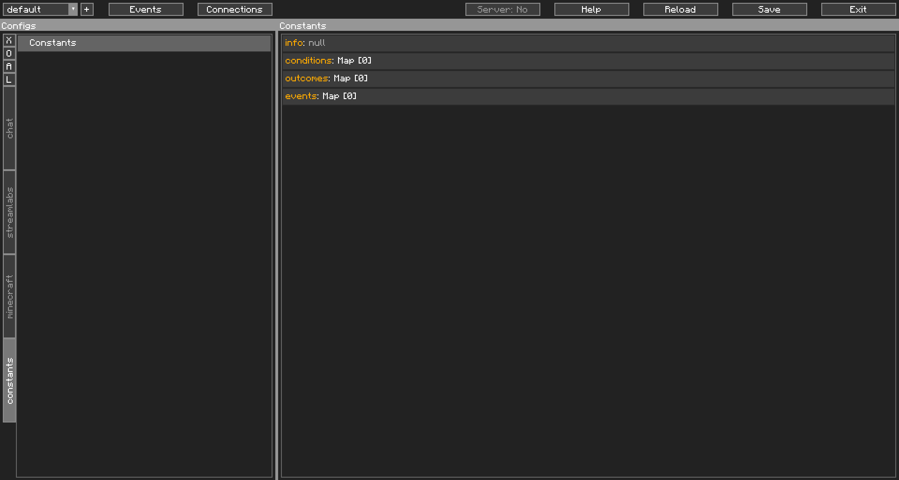
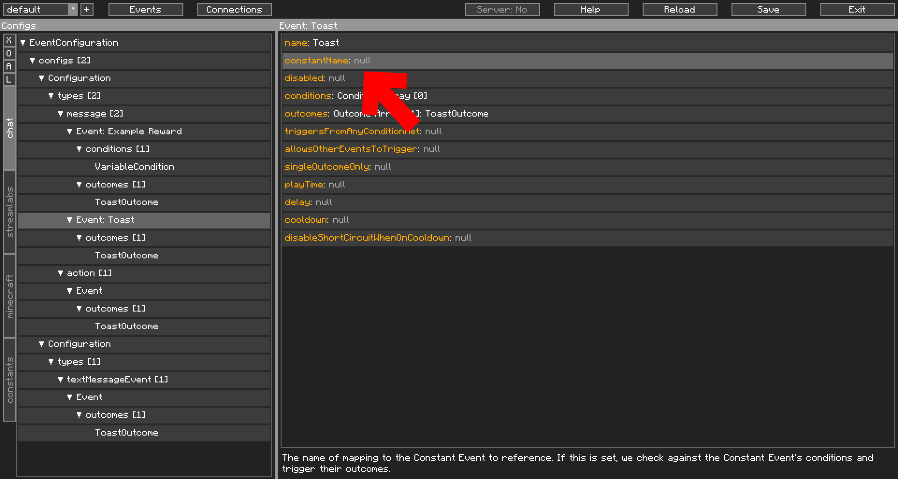
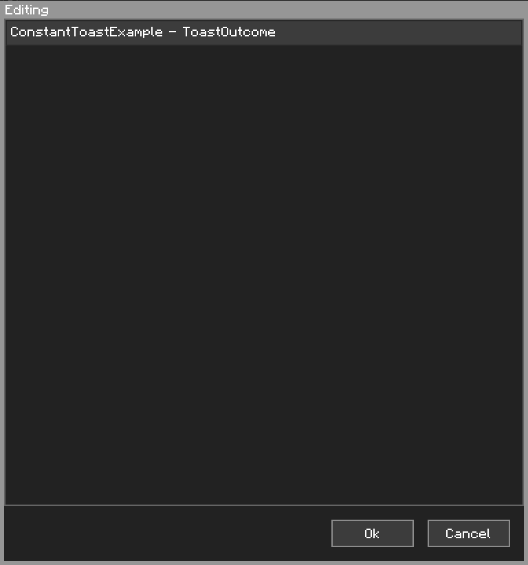

Constants, the Solution to Insanity
===================================

As you probably have seen, the term "constants" have been used every now and then. Constants are, to a degree, a way to direct a Config Event Object to a static reference. 

Think of it this way. When you get bits, you spawn a pig. You get a subscription, you spawn a pig. You get raided, you spawn a pig, You get a follow, you sp-well, you see the pattern. In every one of those Config Events, you have a `CommandOutcome` that spawns the pig. But then round comes October, and in your "festive" mood, you decide to spawn a <s>Zombie Pigman</s> Piglin instead. There you go changing 4+ Outcomes.

Here's where you're thinking: "*There has to be a better way!*". The solution to that, is Constants. Have all those Outcomes point to the same, one Constant, change the Constant, change them all. That's the idea.

## How to use Constants

First, let's look at Constants in the Editor:

{: class="img_center"}
 
 

Off the bat, you can see there's three different type of Constants. Conditions, Outcomes and Config Events. To add a Constant, you first need to think of a name for it. This will be the reference to the constant, so you cannot use conflicting names. Set the name, and if you're adding a Condition or an Outcome, select one. Do whatever you want inside the Object, at this point I'd hope you'd know how to do that (You may have to go back to the Getting Started section for a refresher if you don't).

For the purposes of this guide, I'll be adding a `ToastOutcome` to the constant name `ConstantToastExample`:

{: class="img_center"}
 
 

Now, you're probably wondering, how to reference this. Config Events and Conditions/Outcomes differ slightly, as such:

#### Event

Config Events use the `constantName` field.

{: class="img_center"}
 
 

When using this field, some of the Config Event's behaviour changes. Most of the Config Event's fields are ignored (the Constant Event's is used instead) except for the following:

* Queues & Play Time
* Delays
* Cooldowns

These are intentionally kept separate from the Constant Event as different Event Types may have different queues etc. In the Constant Event, you may check the Event type and such by checking the `cci-type` variables.

#### Conditions and Outcomes

These use the `ConstantCondition` or `ConstantOutcome` Objects. Double clicking on the `name` field will open up the Constants selector. Shift Double Clicking will open up the usual String editor for manual input.

Here in this `ConstantOutcome` you can see our only Constant Outcome in the list, the `ConstantToastExample`:

{: class="img_center"}
 
 
 

#### Final Note

Be careful not to reference a constant recursively without having some kind of break out of that loop. If you do, the game will lock up and crash. CCI makes no checks for this.

The `constantName` and `name` fields in Event and Condition/Outcome also support Variable Insertion. Be mindful of this!
