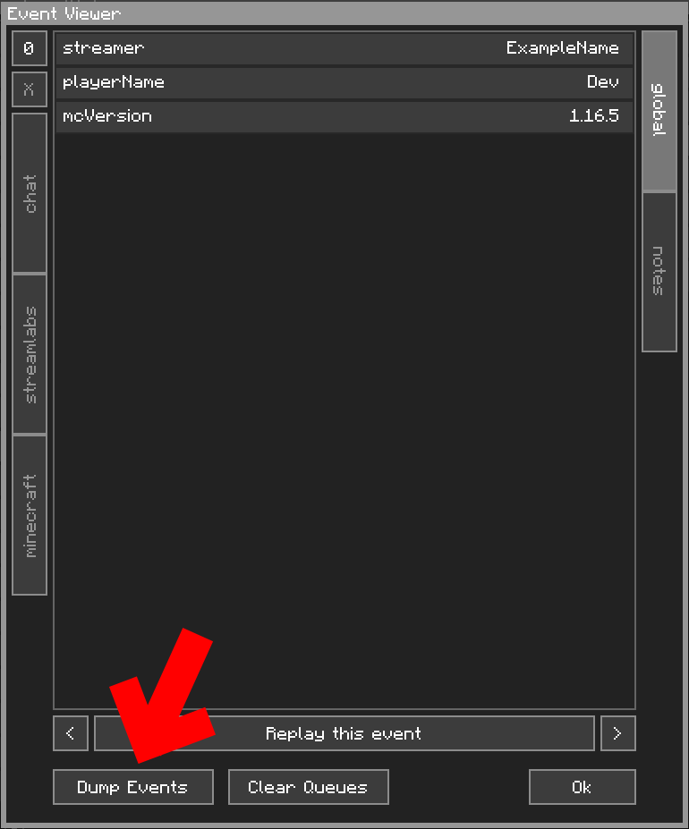

Debugging the PEBKAC Issue
==========================

Naturally, with the flexibility that CCI offers, there will be hiccups here or there. This page aims to help you figure out what went wrong, and where.

Unfortunately, CCI was not built with debugging in mind. As such, debug functions are lackluster. What can be offered, however, are two simple tools: The `LogArgsCondition` and the `Dump Events` functions. We will not talk about `Debug Mode` here, that is explained [here](../../advanced/debugmode/).

## The Log Args Condition

Erroneously named, [this condition](../../components/config/condition/unconditional/LogArgsCondition/) is more akin to a "Log Variables Condition". To use this, you first need the Java Console open, as this conditions spits out the information there. You'll have to look up how to open this console for your specific launcher, I'm afraid. 

### How it works

The `LogArgsCondition`, when triggered, collects all of the Global Variables and Local Variables and puts them into the Java Console. As the Event Viewer only shows you variables *after* the Event has been processed, this lets you see how the variables change as Conditions and Outcomes change them.

To use this in within the Outcomes block, use a `ConditionalOutcome`.

 

## Dump Events

In the Event Viewer, there is a button called `Dump Events`. 

{: class="img_center"}
 
 

Clicking on this button dumps the variables of all **cached** Events, for all the socket layers connected at the time, into a `dump.json` file, in your profile folder. However, this function was made pre-dating the CCI Editor, so what this essentially does is [serialises](https://en.wikipedia.org/wiki/Serialization) what you can see in the Event Viewer.

| Reminder |
| -------- |
| Only Events that pass through Configuration's `for` filter will appear here. To capture every Event, have a Configuration with a `for` type set to `null`.         |
